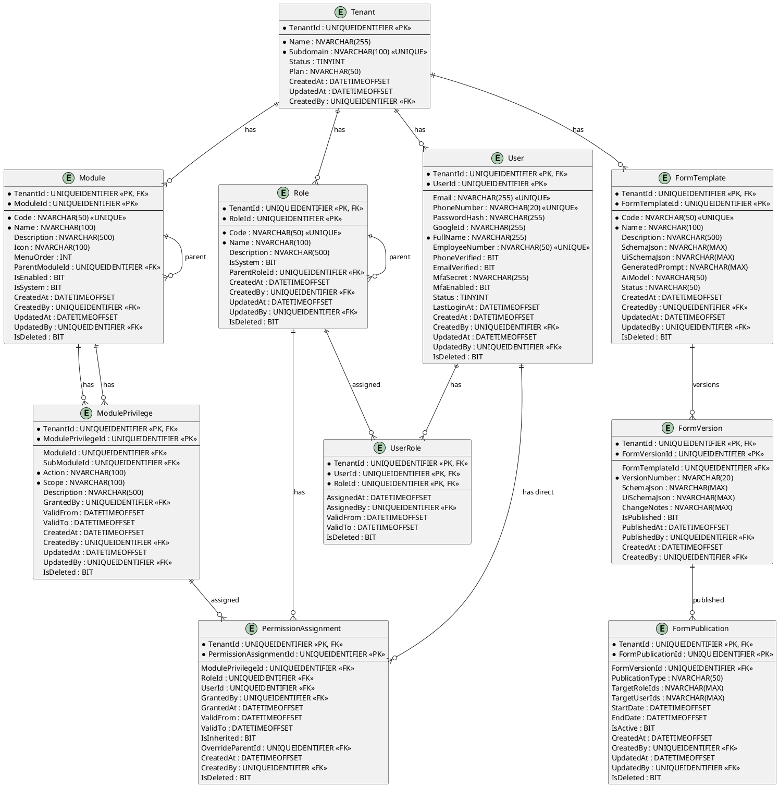
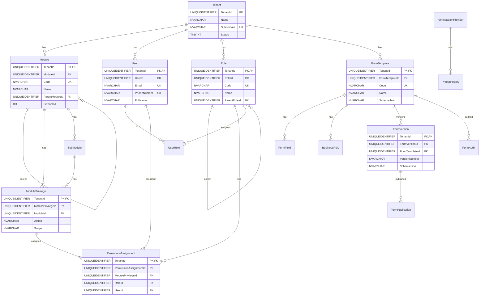

# Arquitectura Completa - Sistema Multi-Tenant con Form Builder IA

## Resumen Ejecutivo

Este documento presenta el diseño arquitectónico integral para la evolución del sistema TimeControl hacia una plataforma SaaS multi-tenant de nivel empresarial con soporte para Form Builder con IA, CQRS, DDD, y gobernanza avanzada de módulos y permisos.

### Objetivos Principales

1. **Multi-tenancy robusto**: Esquema compartido con aislamiento por TenantId, claves compuestas, y filtros globales
2. **Gobernanza de módulos**: Sistema jerárquico de módulos, submódulos, privilegios y permisos con herencia
3. **Form Builder IA**: Generación de formularios desde lenguaje natural, versionado, validaciones y publicación controlada
4. **CQRS + Mediator**: Separación de comandos y consultas para escalabilidad y mantenibilidad
5. **Domain Events**: Eventos de dominio para desacoplamiento y trazabilidad
6. **Seguridad empresarial**: OWASP Top 10, aislamiento multi-tenant, rate limiting, encriptación
7. **Observabilidad**: Logging estructurado, métricas, tracing distribuido
8. **CI/CD**: Pipelines automatizados con quality gates

### Stack Tecnológico

- **Framework**: .NET 8 / ASP.NET Core Web API
- **ORM**: Entity Framework Core 8
- **Base de Datos**: SQL Server / MySQL con soporte multi-tenant
- **CQRS**: MediatR
- **Validación**: FluentValidation
- **Cache**: Redis
- **Mensajería**: RabbitMQ / Azure Service Bus
- **Autenticación**: OpenIddict / Azure Entra ID
- **IA**: Azure OpenAI SDK / OpenAI SDK
- **Observabilidad**: Serilog + Elasticsearch + OpenTelemetry
- **Testing**: xUnit + WebApplicationFactory
- **CI/CD**: GitHub Actions / Azure DevOps

---

## Riesgos y Mitigaciones

### Riesgo 1: Fuga de Datos Multi-Tenant

**Descripción**: Acceso no autorizado a datos de otros tenants debido a filtros de TenantId incorrectos o ausentes.

**Mitigaciones**:
- ✅ Filtros globales de EF Core aplicados automáticamente en todas las consultas
- ✅ Claves compuestas (TenantId + EntityId) en todas las tablas
- ✅ Unit of Work con validación de TenantId en cada operación
- ✅ Auditoría de acceso a datos con logs de seguridad
- ✅ Tests de integración que validan aislamiento
- ✅ Code review obligatorio para cambios en repositorios
- ✅ Rate limiting por tenant para prevenir ataques

**Probabilidad**: Media  
**Impacto**: Crítico  
**Riesgo Residual**: Bajo

---

### Riesgo 2: Latencia en Entornos Distribuidos

**Descripción**: Degradación de rendimiento por consultas distribuidas, cache misses, y llamadas a servicios externos.

**Mitigaciones**:
- ✅ Cache distribuido (Redis) con estrategias de invalidación inteligente
- ✅ Índices optimizados por TenantId en todas las tablas
- ✅ Paginación en todas las consultas
- ✅ Query splitting y proyecciones optimizadas
- ✅ Circuit breakers (Polly) para servicios externos
- ✅ CDN para assets estáticos
- ✅ Database sharding horizontal cuando sea necesario
- ✅ Monitoring de latencia con alertas

**Probabilidad**: Media  
**Impacto**: Alto  
**Riesgo Residual**: Medio

---

### Riesgo 3: Controles de Seguridad Insuficientes

**Descripción**: Vulnerabilidades en autenticación, autorización, y validación de permisos.

**Mitigaciones**:
- ✅ Policy-based authorization con scope y action
- ✅ Validación de permisos en cada endpoint
- ✅ Rate limiting y throttling por tenant y usuario
- ✅ Sanitización de inputs (XSS, SQL Injection)
- ✅ Encriptación de datos sensibles (PII, contraseñas)
- ✅ Rotación de secretos y tokens
- ✅ Auditoría completa de acciones críticas
- ✅ Penetration testing regular
- ✅ Checklist de seguridad OWASP

**Probabilidad**: Media  
**Impacto**: Crítico  
**Riesgo Residual**: Bajo

---

### Riesgo 4: Escalabilidad del Form Builder IA

**Descripción**: Costos y latencia altos por uso excesivo de APIs de IA, falta de cache de prompts similares.

**Mitigaciones**:
- ✅ Cache de esquemas de formularios generados (similaridad de prompts)
- ✅ Rate limiting por tenant en endpoints de IA
- ✅ Queue de procesamiento asíncrono para generación
- ✅ Límites de tokens y modelos por plan de suscripción
- ✅ Batch processing para múltiples generaciones
- ✅ Fallback a plantillas predefinidas en caso de error
- ✅ Monitoring de costos y uso de IA

**Probabilidad**: Alta  
**Impacto**: Medio  
**Riesgo Residual**: Medio

---

### Riesgo 5: Gobernanza de Versiones y Permisos

**Descripción**: Complejidad en la gestión de versiones de formularios, permisos heredados, y conflictos de permisos.

**Mitigaciones**:
- ✅ Versionado semántico de formularios
- ✅ Sistema de herencia de permisos con overrides explícitos
- ✅ Validación de permisos en tiempo de ejecución
- ✅ Tests automatizados de reglas de negocio
- ✅ Documentación clara de jerarquías
- ✅ UI para visualización de permisos efectivos

**Probabilidad**: Media  
**Impacto**: Medio  
**Riesgo Residual**: Bajo

---

### Riesgo 6: Consistencia de Datos en Transacciones Distribuidas

**Descripción**: Problemas de consistencia en operaciones que involucran múltiples servicios o bases de datos.

**Mitigaciones**:
- ✅ Saga pattern para transacciones distribuidas
- ✅ Eventual consistency con compensación
- ✅ Idempotencia en operaciones críticas
- ✅ Distributed locks (Redis) para operaciones concurrentes
- ✅ Event sourcing para auditoría completa
- ✅ Tests de consistencia en escenarios complejos

**Probabilidad**: Baja  
**Impacto**: Alto  
**Riesgo Residual**: Medio

---

## Modelo de Datos

### Estrategia de Particionamiento

El sistema utiliza **esquema compartido con TenantId** para optimizar mantenimiento y escalabilidad:

- **Claves compuestas**: `(TenantId, EntityId)` en todas las tablas tenant-scoped
- **Índices**: Todos los índices incluyen TenantId como primera columna
- **Filtros globales**: EF Core aplica automáticamente `WHERE TenantId = @CurrentTenantId`
- **Sharding opcional**: Preparado para particionamiento horizontal cuando sea necesario
- **Cache distribuido**: Claves incluyen TenantId para aislamiento

### Tablas Núcleo

#### 1. Tenant

Tabla raíz que identifica cada tenant (empresa). Mantenida en BD maestra.

| Campo              | Tipo             | PK | FK | Notas                                     |
|--------------------|------------------|----|----|-------------------------------------------|
| TenantId           | UNIQUEIDENTIFIER | ✔  |    | PRIMARY KEY                               |
| Name               | NVARCHAR(255)    |    |    | Nombre de la empresa                      |
| Subdomain          | NVARCHAR(100)    |    |    | UNIQUE, subdominio (ej: acme)             |
| Status             | TINYINT          |    |    | 1=Activo, 0=Inactivo, 2=Suspendido       |
| Plan               | NVARCHAR(50)     |    |    | Basic, Pro, Enterprise                    |
| CreatedAt          | DATETIMEOFFSET   |    |    |                                           |
| UpdatedAt          | DATETIMEOFFSET   |    |    |                                           |
| CreatedBy          | UNIQUEIDENTIFIER |    | FK | FK -> MasterUser                          |

**Índices**:
- `IX_Tenant_Subdomain` (Subdomain) UNIQUE
- `IX_Tenant_Status` (Status)

---

#### 2. Module

Módulos del sistema (Timesheet, Reports, Settings, FormBuilder, etc.)

| Campo              | Tipo             | PK | FK | Notas                                     |
|--------------------|------------------|----|----|-------------------------------------------|
| ModuleId           | UNIQUEIDENTIFIER | ✔  |    | PRIMARY KEY                               |
| TenantId           | UNIQUEIDENTIFIER | ✔* | FK | Composite PK (TenantId, ModuleId)         |
| Code               | NVARCHAR(50)     |    |    | UNIQUE por tenant (timesheet, reports)    |
| Name               | NVARCHAR(100)    |    |    |                                           |
| Description        | NVARCHAR(500)    |    |    |                                           |
| Icon               | NVARCHAR(100)    |    |    | Nombre del icono                          |
| MenuOrder          | INT              |    |    | Orden en menú                             |
| ParentModuleId     | UNIQUEIDENTIFIER |    | FK | FK -> Module (jerarquía)                  |
| IsEnabled          | BIT              |    |    |                                           |
| IsSystem           | BIT              |    |    | Módulos del sistema no se pueden eliminar |
| CreatedAt          | DATETIMEOFFSET   |    |    |                                           |
| CreatedBy          | UNIQUEIDENTIFIER |    | FK | FK -> User                                |
| UpdatedAt          | DATETIMEOFFSET   |    |    |                                           |
| UpdatedBy          | UNIQUEIDENTIFIER |    | FK | FK -> User                                |
| IsDeleted          | BIT              |    |    | Soft delete                               |

**Índices**:
- `PK_Module` (TenantId, ModuleId) PRIMARY KEY
- `IX_Module_Code` (TenantId, Code) UNIQUE
- `IX_Module_ParentModuleId` (TenantId, ParentModuleId)
- `IX_Module_IsDeleted` (TenantId, IsDeleted)

---

#### 3. SubModule

Submódulos dentro de un módulo (opcional, para organización jerárquica)

| Campo              | Tipo             | PK | FK | Notas                                     |
|--------------------|------------------|----|----|-------------------------------------------|
| SubModuleId        | UNIQUEIDENTIFIER | ✔  |    | PRIMARY KEY                               |
| TenantId           | UNIQUEIDENTIFIER | ✔* | FK | Composite PK (TenantId, SubModuleId)      |
| ModuleId           | UNIQUEIDENTIFIER |    | FK | FK -> Module                              |
| Code               | NVARCHAR(50)     |    |    | UNIQUE por módulo                         |
| Name               | NVARCHAR(100)    |    |    |                                           |
| Description        | NVARCHAR(500)    |    |    |                                           |
| MenuOrder          | INT              |    |    |                                           |
| IsEnabled          | BIT              |    |    |                                           |
| CreatedAt          | DATETIMEOFFSET   |    |    |                                           |
| CreatedBy          | UNIQUEIDENTIFIER |    | FK | FK -> User                                |
| UpdatedAt          | DATETIMEOFFSET   |    |    |                                           |
| UpdatedBy          | UNIQUEIDENTIFIER |    | FK | FK -> User                                |
| IsDeleted          | BIT              |    |    | Soft delete                               |

**Índices**:
- `PK_SubModule` (TenantId, SubModuleId) PRIMARY KEY
- `IX_SubModule_ModuleCode` (TenantId, ModuleId, Code) UNIQUE
- `IX_SubModule_IsDeleted` (TenantId, IsDeleted)

---

#### 4. ModulePrivilege

Privilegios o acciones dentro de un módulo (Create, Read, Update, Delete, Execute, Publish, etc.)

| Campo              | Tipo             | PK | FK | Notas                                     |
|--------------------|------------------|----|----|-------------------------------------------|
| ModulePrivilegeId  | UNIQUEIDENTIFIER | ✔  |    | PRIMARY KEY                               |
| TenantId           | UNIQUEIDENTIFIER | ✔* | FK | Composite PK (TenantId, ModulePrivilegeId)|
| ModuleId           | UNIQUEIDENTIFIER |    | FK | FK -> Module                              |
| SubModuleId        | UNIQUEIDENTIFIER |    | FK | FK -> SubModule (opcional)                |
| Action             | NVARCHAR(100)    |    |    | CRUD/Execute/Publish/Approve/Export       |
| Scope              | NVARCHAR(100)    |    |    | OwnTenant/SubTenant/System                |
| Description        | NVARCHAR(500)    |    |    |                                           |
| GrantedBy          | UNIQUEIDENTIFIER |    | FK | FK -> User                                |
| ValidFrom          | DATETIMEOFFSET   |    |    |                                           |
| ValidTo            | DATETIMEOFFSET   |    |    | Nullable                                  |
| CreatedAt          | DATETIMEOFFSET   |    |    |                                           |
| CreatedBy          | UNIQUEIDENTIFIER |    | FK | FK -> User                                |
| UpdatedAt          | DATETIMEOFFSET   |    |    |                                           |
| UpdatedBy          | UNIQUEIDENTIFIER |    | FK | FK -> User                                |
| IsDeleted          | BIT              |    |    | Soft delete                               |

**Índices**:
- `PK_ModulePrivilege` (TenantId, ModulePrivilegeId) PRIMARY KEY
- `IX_ModulePrivilege_ModuleAction` (TenantId, ModuleId, Action)
- `IX_ModulePrivilege_ValidDate` (TenantId, ValidFrom, ValidTo)
- `IX_ModulePrivilege_IsDeleted` (TenantId, IsDeleted)

---

#### 5. PermissionAssignment

Asignación de permisos a roles o usuarios (permisos directos)

| Campo              | Tipo             | PK | FK | Notas                                     |
|--------------------|------------------|----|----|-------------------------------------------|
| PermissionAssignmentId | UNIQUEIDENTIFIER | ✔  |    | PRIMARY KEY                               |
| TenantId           | UNIQUEIDENTIFIER | ✔* | FK | Composite PK                              |
| ModulePrivilegeId  | UNIQUEIDENTIFIER |    | FK | FK -> ModulePrivilege                     |
| RoleId             | UNIQUEIDENTIFIER |    | FK | FK -> Role (opcional, si es null es directo a usuario) |
| UserId             | UNIQUEIDENTIFIER |    | FK | FK -> User (opcional, si es null es a rol)|
| GrantedBy          | UNIQUEIDENTIFIER |    | FK | FK -> User                                |
| GrantedAt          | DATETIMEOFFSET   |    |    |                                           |
| ValidFrom          | DATETIMEOFFSET   |    |    |                                           |
| ValidTo            | DATETIMEOFFSET   |    |    | Nullable                                  |
| IsInherited        | BIT              |    |    | Si viene de herencia                      |
| OverrideParentId   | UNIQUEIDENTIFIER |    | FK | FK -> PermissionAssignment (override)     |
| CreatedAt          | DATETIMEOFFSET   |    |    |                                           |
| CreatedBy          | UNIQUEIDENTIFIER |    | FK | FK -> User                                |
| IsDeleted          | BIT              |    |    | Soft delete                               |

**Índices**:
- `PK_PermissionAssignment` (TenantId, PermissionAssignmentId) PRIMARY KEY
- `IX_PermissionAssignment_Role` (TenantId, RoleId, ModulePrivilegeId)
- `IX_PermissionAssignment_User` (TenantId, UserId, ModulePrivilegeId)
- `IX_PermissionAssignment_ValidDate` (TenantId, ValidFrom, ValidTo)
- `IX_PermissionAssignment_IsDeleted` (TenantId, IsDeleted)

**Constraints**:
- `CK_PermissionAssignment_RoleOrUser`: `(RoleId IS NOT NULL) OR (UserId IS NOT NULL)`

---

#### 6. PermissionGroup

Grupos de permisos para asignación masiva (ej: "Editor Completo", "Solo Lectura")

| Campo              | Tipo             | PK | FK | Notas                                     |
|--------------------|------------------|----|----|-------------------------------------------|
| PermissionGroupId  | UNIQUEIDENTIFIER | ✔  |    | PRIMARY KEY                               |
| TenantId           | UNIQUEIDENTIFIER | ✔* | FK | Composite PK                              |
| Code               | NVARCHAR(50)     |    |    | UNIQUE por tenant                         |
| Name               | NVARCHAR(100)    |    |    |                                           |
| Description        | NVARCHAR(500)    |    |    |                                           |
| IsSystem           | BIT              |    |    | Grupos del sistema                        |
| CreatedAt          | DATETIMEOFFSET   |    |    |                                           |
| CreatedBy          | UNIQUEIDENTIFIER |    | FK | FK -> User                                |
| UpdatedAt          | DATETIMEOFFSET   |    |    |                                           |
| UpdatedBy          | UNIQUEIDENTIFIER |    | FK | FK -> User                                |
| IsDeleted          | BIT              |    |    | Soft delete                               |

**Índices**:
- `PK_PermissionGroup` (TenantId, PermissionGroupId) PRIMARY KEY
- `IX_PermissionGroup_Code` (TenantId, Code) UNIQUE
- `IX_PermissionGroup_IsDeleted` (TenantId, IsDeleted)

---

#### 7. PermissionGroupAssignment

Relación entre grupos de permisos y privilegios

| Campo              | Tipo             | PK | FK | Notas                                     |
|--------------------|------------------|----|----|-------------------------------------------|
| PermissionGroupId  | UNIQUEIDENTIFIER | ✔* | FK | Composite PK (TenantId, PermissionGroupId)|
| ModulePrivilegeId  | UNIQUEIDENTIFIER | ✔* | FK | Composite PK (TenantId, ModulePrivilegeId)|
| TenantId           | UNIQUEIDENTIFIER | ✔* | FK | Composite PK                              |
| CreatedAt          | DATETIMEOFFSET   |    |    |                                           |
| CreatedBy          | UNIQUEIDENTIFIER |    | FK | FK -> User                                |

**Índices**:
- `PK_PermissionGroupAssignment` (TenantId, PermissionGroupId, ModulePrivilegeId) PRIMARY KEY

---

#### 8. Role

Roles de usuario (SuperAdmin, Admin, Supervisor, Employee, etc.)

| Campo              | Tipo             | PK | FK | Notas                                     |
|--------------------|------------------|----|----|-------------------------------------------|
| RoleId             | UNIQUEIDENTIFIER | ✔  |    | PRIMARY KEY                               |
| TenantId           | UNIQUEIDENTIFIER | ✔* | FK | Composite PK (TenantId, RoleId)           |
| Code               | NVARCHAR(50)     |    |    | UNIQUE por tenant                         |
| Name               | NVARCHAR(100)    |    |    |                                           |
| Description        | NVARCHAR(500)    |    |    |                                           |
| IsSystem           | BIT              |    |    | Roles del sistema                         |
| ParentRoleId       | UNIQUEIDENTIFIER |    | FK | FK -> Role (herencia de permisos)         |
| CreatedAt          | DATETIMEOFFSET   |    |    |                                           |
| CreatedBy          | UNIQUEIDENTIFIER |    | FK | FK -> User                                |
| UpdatedAt          | DATETIMEOFFSET   |    |    |                                           |
| UpdatedBy          | UNIQUEIDENTIFIER |    | FK | FK -> User                                |
| IsDeleted          | BIT              |    |    | Soft delete                               |

**Índices**:
- `PK_Role` (TenantId, RoleId) PRIMARY KEY
- `IX_Role_Code` (TenantId, Code) UNIQUE
- `IX_Role_ParentRoleId` (TenantId, ParentRoleId)
- `IX_Role_IsDeleted` (TenantId, IsDeleted)

---

#### 9. UserRole

Asignación de roles a usuarios

| Campo              | Tipo             | PK | FK | Notas                                     |
|--------------------|------------------|----|----|-------------------------------------------|
| TenantId           | UNIQUEIDENTIFIER | ✔* | FK | Composite PK                              |
| UserId             | UNIQUEIDENTIFIER | ✔* | FK | Composite PK (TenantId, UserId)           |
| RoleId             | UNIQUEIDENTIFIER | ✔* | FK | Composite PK (TenantId, RoleId)           |
| AssignedAt         | DATETIMEOFFSET   |    |    |                                           |
| AssignedBy         | UNIQUEIDENTIFIER |    | FK | FK -> User                                |
| ValidFrom          | DATETIMEOFFSET   |    |    |                                           |
| ValidTo            | DATETIMEOFFSET   |    |    | Nullable                                  |
| IsDeleted          | BIT              |    |    | Soft delete                               |

**Índices**:
- `PK_UserRole` (TenantId, UserId, RoleId) PRIMARY KEY
- `IX_UserRole_User` (TenantId, UserId)
- `IX_UserRole_Role` (TenantId, RoleId)
- `IX_UserRole_ValidDate` (TenantId, ValidFrom, ValidTo)

---

#### 10. User (Extendido)

Usuarios del tenant (extendido con campos multi-tenant)

| Campo              | Tipo             | PK | FK | Notas                                     |
|--------------------|------------------|----|----|-------------------------------------------|
| UserId             | UNIQUEIDENTIFIER | ✔  |    | PRIMARY KEY                               |
| TenantId           | UNIQUEIDENTIFIER | ✔* | FK | Composite PK (TenantId, UserId)           |
| Email              | NVARCHAR(255)    |    |    | UNIQUE por tenant                         |
| PhoneNumber        | NVARCHAR(20)     |    |    | UNIQUE por tenant                         |
| PasswordHash       | NVARCHAR(255)    |    |    | Argon2id hash                              |
| GoogleId           | NVARCHAR(255)    |    |    | OAuth                                     |
| FullName           | NVARCHAR(255)    |    |    |                                           |
| EmployeeNumber     | NVARCHAR(50)     |    |    | UNIQUE por tenant                         |
| PhoneVerified      | BIT              |    |    |                                           |
| EmailVerified      | BIT              |    |    |                                           |
| MfaSecret          | NVARCHAR(255)    |    |    | TOTP secret                               |
| MfaEnabled         | BIT              |    |    |                                           |
| Status             | TINYINT          |    |    | 1=Activo, 0=Inactivo, 2=Bloqueado         |
| LastLoginAt        | DATETIMEOFFSET   |    |    |                                           |
| CreatedAt          | DATETIMEOFFSET   |    |    |                                           |
| CreatedBy          | UNIQUEIDENTIFIER |    | FK | FK -> User                                |
| UpdatedAt          | DATETIMEOFFSET   |    |    |                                           |
| UpdatedBy          | UNIQUEIDENTIFIER |    | FK | FK -> User                                |
| IsDeleted          | BIT              |    |    | Soft delete                               |

**Índices**:
- `PK_User` (TenantId, UserId) PRIMARY KEY
- `IX_User_Email` (TenantId, Email) UNIQUE
- `IX_User_PhoneNumber` (TenantId, PhoneNumber) UNIQUE
- `IX_User_EmployeeNumber` (TenantId, EmployeeNumber) UNIQUE
- `IX_User_Status` (TenantId, Status)
- `IX_User_IsDeleted` (TenantId, IsDeleted)

---

#### 11. FeatureFlag

Feature flags por tenant para control de funcionalidades

| Campo              | Tipo             | PK | FK | Notas                                     |
|--------------------|------------------|----|----|-------------------------------------------|
| FeatureFlagId      | UNIQUEIDENTIFIER | ✔  |    | PRIMARY KEY                               |
| TenantId           | UNIQUEIDENTIFIER | ✔* | FK | Composite PK (TenantId, FeatureFlagId)    |
| Code               | NVARCHAR(50)     |    |    | UNIQUE por tenant                         |
| Name               | NVARCHAR(100)    |    |    |                                           |
| Description        | NVARCHAR(500)    |    |    |                                           |
| IsEnabled          | BIT              |    |    |                                           |
| RolloutPercentage  | INT              |    |    | 0-100 para rollout gradual                |
| ValidFrom          | DATETIMEOFFSET   |    |    |                                           |
| ValidTo            | DATETIMEOFFSET   |    |    | Nullable                                  |
| CreatedAt          | DATETIMEOFFSET   |    |    |                                           |
| CreatedBy          | UNIQUEIDENTIFIER |    | FK | FK -> User                                |
| UpdatedAt          | DATETIMEOFFSET   |    |    |                                           |
| UpdatedBy          | UNIQUEIDENTIFIER |    | FK | FK -> User                                |
| IsDeleted          | BIT              |    |    | Soft delete                               |

**Índices**:
- `PK_FeatureFlag` (TenantId, FeatureFlagId) PRIMARY KEY
- `IX_FeatureFlag_Code` (TenantId, Code) UNIQUE
- `IX_FeatureFlag_ValidDate` (TenantId, ValidFrom, ValidTo)

---

### Tablas de Soporte

#### 12. HierarchicalRelation

Relaciones jerárquicas entre entidades (empresa padre-hijo, usuario supervisor-empleado)

| Campo              | Tipo             | PK | FK | Notas                                     |
|--------------------|------------------|----|----|-------------------------------------------|
| HierarchicalRelationId | UNIQUEIDENTIFIER | ✔  |    | PRIMARY KEY                               |
| TenantId           | UNIQUEIDENTIFIER | ✔* | FK | Composite PK                              |
| EntityType         | NVARCHAR(50)     |    |    | Company, User, Department, etc.           |
| ParentEntityId     | UNIQUEIDENTIFIER |    |    | ID de la entidad padre                    |
| ChildEntityId      | UNIQUEIDENTIFIER |    |    | ID de la entidad hijo                     |
| RelationType       | NVARCHAR(50)     |    |    | Parent, Supervisor, Manager, etc.         |
| ValidFrom          | DATETIMEOFFSET   |    |    |                                           |
| ValidTo            | DATETIMEOFFSET   |    |    | Nullable                                  |
| CreatedAt          | DATETIMEOFFSET   |    |    |                                           |
| CreatedBy          | UNIQUEIDENTIFIER |    | FK | FK -> User                                |
| IsDeleted          | BIT              |    |    | Soft delete                               |

**Índices**:
- `PK_HierarchicalRelation` (TenantId, HierarchicalRelationId) PRIMARY KEY
- `IX_HierarchicalRelation_Parent` (TenantId, EntityType, ParentEntityId)
- `IX_HierarchicalRelation_Child` (TenantId, EntityType, ChildEntityId)
- `IX_HierarchicalRelation_ValidDate` (TenantId, ValidFrom, ValidTo)

---

#### 13. AccessEndpoint

Registro de endpoints y permisos requeridos

| Campo              | Tipo             | PK | FK | Notas                                     |
|--------------------|------------------|----|----|-------------------------------------------|
| AccessEndpointId   | UNIQUEIDENTIFIER | ✔  |    | PRIMARY KEY                               |
| TenantId           | UNIQUEIDENTIFIER | ✔* | FK | Composite PK (TenantId, AccessEndpointId) |
| Method             | NVARCHAR(10)     |    |    | GET, POST, PUT, DELETE, etc.              |
| Path               | NVARCHAR(500)    |    |    | /api/users, /api/timesheets/{id}          |
| ModuleId           | UNIQUEIDENTIFIER |    | FK | FK -> Module                              |
| RequiredPrivilege  | NVARCHAR(100)    |    |    | Action requerida (Create, Read, Update)   |
| Description        | NVARCHAR(500)    |    |    |                                           |
| IsActive           | BIT              |    |    |                                           |
| CreatedAt          | DATETIMEOFFSET   |    |    |                                           |
| CreatedBy          | UNIQUEIDENTIFIER |    | FK | FK -> User                                |
| UpdatedAt          | DATETIMEOFFSET   |    |    |                                           |
| UpdatedBy          | UNIQUEIDENTIFIER |    | FK | FK -> User                                |
| IsDeleted          | BIT              |    |    | Soft delete                               |

**Índices**:
- `PK_AccessEndpoint` (TenantId, AccessEndpointId) PRIMARY KEY
- `IX_AccessEndpoint_Path` (TenantId, Method, Path)
- `IX_AccessEndpoint_Module` (TenantId, ModuleId)

---

#### 14. AccessLog

Log de acceso a endpoints para auditoría

| Campo              | Tipo             | PK | FK | Notas                                     |
|--------------------|------------------|----|----|-------------------------------------------|
| AccessLogId        | BIGINT           | ✔  |    | PRIMARY KEY (IDENTITY)                    |
| TenantId           | UNIQUEIDENTIFIER |    |    | No FK, puede ser histórico                |
| UserId             | UNIQUEIDENTIFIER |    |    | Usuario que hizo la petición              |
| Endpoint           | NVARCHAR(500)    |    |    | Path completo                              |
| Method             | NVARCHAR(10)     |    |    | HTTP method                                |
| StatusCode         | INT              |    |    | HTTP status code                           |
| IpAddress          | NVARCHAR(45)     |    |    | IPv4 o IPv6                                |
| UserAgent          | NVARCHAR(500)    |    |    |                                           |
| RequestBody        | NVARCHAR(MAX)    |    |    | JSON (redactado si contiene PII)          |
| ResponseBody       | NVARCHAR(MAX)    |    |    | JSON (redactado si contiene PII)          |
| DurationMs         | INT              |    |    | Duración en milisegundos                  |
| CreatedAt          | DATETIMEOFFSET   |    |    |                                           |

**Índices**:
- `PK_AccessLog` (AccessLogId) PRIMARY KEY
- `IX_AccessLog_TenantUser` (TenantId, UserId, CreatedAt)
- `IX_AccessLog_Endpoint` (TenantId, Endpoint, CreatedAt)
- `IX_AccessLog_CreatedAt` (CreatedAt) (para particionamiento por fecha)

---

#### 15. TenantSetting

Configuraciones por tenant (key-value)

| Campo              | Tipo             | PK | FK | Notas                                     |
|--------------------|------------------|----|----|-------------------------------------------|
| TenantSettingId    | UNIQUEIDENTIFIER | ✔  |    | PRIMARY KEY                               |
| TenantId           | UNIQUEIDENTIFIER | ✔* | FK | Composite PK (TenantId, TenantSettingId)  |
| Key                | NVARCHAR(100)    |    |    | UNIQUE por tenant                         |
| Value              | NVARCHAR(MAX)    |    |    | JSON o texto                              |
| Category           | NVARCHAR(50)     |    |    | Security, UI, BusinessRules, etc.         |
| Description        | NVARCHAR(500)    |    |    |                                           |
| IsEncrypted        | BIT              |    |    | Si requiere desencriptación               |
| CreatedAt          | DATETIMEOFFSET   |    |    |                                           |
| CreatedBy          | UNIQUEIDENTIFIER |    | FK | FK -> User                                |
| UpdatedAt          | DATETIMEOFFSET   |    |    |                                           |
| UpdatedBy          | UNIQUEIDENTIFIER |    | FK | FK -> User                                |
| IsDeleted          | BIT              |    |    | Soft delete                               |

**Índices**:
- `PK_TenantSetting` (TenantId, TenantSettingId) PRIMARY KEY
- `IX_TenantSetting_Key` (TenantId, Key) UNIQUE
- `IX_TenantSetting_Category` (TenantId, Category)

---

#### 16. DynamicMenu

Menú dinámico por tenant y rol

| Campo              | Tipo             | PK | FK | Notas                                     |
|--------------------|------------------|----|----|-------------------------------------------|
| DynamicMenuId      | UNIQUEIDENTIFIER | ✔  |    | PRIMARY KEY                               |
| TenantId           | UNIQUEIDENTIFIER | ✔* | FK | Composite PK (TenantId, DynamicMenuId)    |
| RoleId             | UNIQUEIDENTIFIER |    | FK | FK -> Role (opcional, null = todos)       |
| ModuleId           | UNIQUEIDENTIFIER |    | FK | FK -> Module                              |
| Label              | NVARCHAR(100)    |    |    |                                           |
| Icon               | NVARCHAR(100)    |    |    |                                           |
| Path               | NVARCHAR(500)    |    |    | Ruta de navegación                        |
| MenuOrder          | INT              |    |    |                                           |
| ParentMenuId       | UNIQUEIDENTIFIER |    | FK | FK -> DynamicMenu (jerarquía)             |
| IsVisible          | BIT              |    |    |                                           |
| CreatedAt          | DATETIMEOFFSET   |    |    |                                           |
| CreatedBy          | UNIQUEIDENTIFIER |    | FK | FK -> User                                |
| UpdatedAt          | DATETIMEOFFSET   |    |    |                                           |
| UpdatedBy          | UNIQUEIDENTIFIER |    | FK | FK -> User                                |
| IsDeleted          | BIT              |    |    | Soft delete                               |

**Índices**:
- `PK_DynamicMenu` (TenantId, DynamicMenuId) PRIMARY KEY
- `IX_DynamicMenu_Role` (TenantId, RoleId)
- `IX_DynamicMenu_Parent` (TenantId, ParentMenuId)
- `IX_DynamicMenu_Order` (TenantId, MenuOrder)

---

### Tablas Form Builder IA

#### 17. FormTemplate

Plantillas de formularios generadas por IA

| Campo              | Tipo             | PK | FK | Notas                                     |
|--------------------|------------------|----|----|-------------------------------------------|
| FormTemplateId     | UNIQUEIDENTIFIER | ✔  |    | PRIMARY KEY                               |
| TenantId           | UNIQUEIDENTIFIER | ✔* | FK | Composite PK (TenantId, FormTemplateId)   |
| Code               | NVARCHAR(50)     |    |    | UNIQUE por tenant                         |
| Name               | NVARCHAR(100)    |    |    |                                           |
| Description        | NVARCHAR(500)    |    |    |                                           |
| SchemaJson         | NVARCHAR(MAX)    |    |    | JSON Schema del formulario                |
| UiSchemaJson       | NVARCHAR(MAX)    |    |    | JSON Schema UI (layout, widgets)          |
| GeneratedPrompt    | NVARCHAR(MAX)    |    |    | Prompt original usado para generar        |
| AiModel            | NVARCHAR(50)     |    |    | gpt-4o, gpt-4-turbo, claude-3, etc.      |
| Status             | NVARCHAR(50)     |    |    | Draft, Published, Archived                |
| CreatedAt          | DATETIMEOFFSET   |    |    |                                           |
| CreatedBy          | UNIQUEIDENTIFIER |    | FK | FK -> User                                |
| UpdatedAt          | DATETIMEOFFSET   |    |    |                                           |
| UpdatedBy          | UNIQUEIDENTIFIER |    | FK | FK -> User                                |
| IsDeleted          | BIT              |    |    | Soft delete                               |

**Índices**:
- `PK_FormTemplate` (TenantId, FormTemplateId) PRIMARY KEY
- `IX_FormTemplate_Code` (TenantId, Code) UNIQUE
- `IX_FormTemplate_Status` (TenantId, Status)
- `IX_FormTemplate_CreatedAt` (TenantId, CreatedAt)

---

#### 18. FormField

Campos de un formulario (metadatos detallados)

| Campo              | Tipo             | PK | FK | Notas                                     |
|--------------------|------------------|----|----|-------------------------------------------|
| FormFieldId        | UNIQUEIDENTIFIER | ✔  |    | PRIMARY KEY                               |
| TenantId           | UNIQUEIDENTIFIER | ✔* | FK | Composite PK (TenantId, FormFieldId)      |
| FormTemplateId     | UNIQUEIDENTIFIER |    | FK | FK -> FormTemplate                        |
| FieldName          | NVARCHAR(100)    |    |    | Nombre técnico                            |
| FieldType          | NVARCHAR(50)     |    |    | text, number, date, select, etc.          |
| Label              | NVARCHAR(200)    |    |    | Etiqueta visible                          |
| Placeholder        | NVARCHAR(200)    |    |    |                                           |
| IsRequired         | BIT              |    |    |                                           |
| DefaultValue       | NVARCHAR(MAX)    |    |    | JSON                                      |
| ValidationRules    | NVARCHAR(MAX)    |    |    | JSON con reglas de validación             |
| DisplayOrder       | INT              |    |    |                                           |
| CreatedAt          | DATETIMEOFFSET   |    |    |                                           |
| CreatedBy          | UNIQUEIDENTIFIER |    | FK | FK -> User                                |
| UpdatedAt          | DATETIMEOFFSET   |    |    |                                           |
| UpdatedBy          | UNIQUEIDENTIFIER |    | FK | FK -> User                                |
| IsDeleted          | BIT              |    |    | Soft delete                               |

**Índices**:
- `PK_FormField` (TenantId, FormFieldId) PRIMARY KEY
- `IX_FormField_Template` (TenantId, FormTemplateId, DisplayOrder)

---

#### 19. BusinessRule

Reglas de negocio para formularios (validaciones, cálculos, acciones)

| Campo              | Tipo             | PK | FK | Notas                                     |
|--------------------|------------------|----|----|-------------------------------------------|
| BusinessRuleId     | UNIQUEIDENTIFIER | ✔  |    | PRIMARY KEY                               |
| TenantId           | UNIQUEIDENTIFIER | ✔* | FK | Composite PK (TenantId, BusinessRuleId)   |
| FormTemplateId     | UNIQUEIDENTIFIER |    | FK | FK -> FormTemplate                        |
| RuleType           | NVARCHAR(50)     |    |    | Validation, Calculation, Action, Visibility |
| RuleName           | NVARCHAR(100)    |    |    |                                           |
| Expression         | NVARCHAR(MAX)    |    |    | JavaScript/JSON Logic expression          |
| TriggerFields      | NVARCHAR(MAX)    |    |    | JSON array de campos que activan          |
| TargetFields       | NVARCHAR(MAX)    |    |    | JSON array de campos afectados            |
| ErrorMessage       | NVARCHAR(500)    |    |    | Mensaje de error si falla validación      |
| IsActive           | BIT              |    |    |                                           |
| CreatedAt          | DATETIMEOFFSET   |    |    |                                           |
| CreatedBy          | UNIQUEIDENTIFIER |    | FK | FK -> User                                |
| UpdatedAt          | DATETIMEOFFSET   |    |    |                                           |
| UpdatedBy          | UNIQUEIDENTIFIER |    | FK | FK -> User                                |
| IsDeleted          | BIT              |    |    | Soft delete                               |

**Índices**:
- `PK_BusinessRule` (TenantId, BusinessRuleId) PRIMARY KEY
- `IX_BusinessRule_Template` (TenantId, FormTemplateId, RuleType)
- `IX_BusinessRule_IsActive` (TenantId, IsActive)

---

#### 20. AiIntegrationProvider

Configuración de proveedores de IA (OpenAI, Azure OpenAI, etc.)

| Campo              | Tipo             | PK | FK | Notas                                     |
|--------------------|------------------|----|----|-------------------------------------------|
| AiProviderId       | UNIQUEIDENTIFIER | ✔  |    | PRIMARY KEY                               |
| TenantId           | UNIQUEIDENTIFIER | ✔* | FK | Composite PK (TenantId, AiProviderId)     |
| ProviderName       | NVARCHAR(50)     |    |    | OpenAI, AzureOpenAI, Anthropic, etc.      |
| ApiKey             | NVARCHAR(500)    |    |    | Encriptado                                |
| BaseUrl            | NVARCHAR(500)    |    |    |                                           |
| DefaultModel       | NVARCHAR(50)     |    |    | gpt-4o, gpt-4-turbo, etc.                 |
| MaxTokens          | INT              |    |    | Límite de tokens por request              |
| RateLimitPerMinute | INT              |    |    | Límite de requests por minuto             |
| IsActive           | BIT              |    |    |                                           |
| CreatedAt          | DATETIMEOFFSET   |    |    |                                           |
| CreatedBy          | UNIQUEIDENTIFIER |    | FK | FK -> User                                |
| UpdatedAt          | DATETIMEOFFSET   |    |                                           |
| UpdatedBy          | UNIQUEIDENTIFIER |    | FK | FK -> User                                |
| IsDeleted          | BIT              |    |    | Soft delete                               |

**Índices**:
- `PK_AiIntegrationProvider` (TenantId, AiProviderId) PRIMARY KEY
- `IX_AiIntegrationProvider_Active` (TenantId, IsActive)

---

#### 21. PromptHistory

Historial de prompts enviados a IA para trazabilidad y cache

| Campo              | Tipo             | PK | FK | Notas                                     |
|--------------------|------------------|----|----|-------------------------------------------|
| PromptHistoryId    | BIGINT           | ✔  |    | PRIMARY KEY (IDENTITY)                    |
| TenantId           | UNIQUEIDENTIFIER |    |    |                                           |
| UserId             | UNIQUEIDENTIFIER |    | FK | FK -> User                                |
| PromptText         | NVARCHAR(MAX)    |    |    | Prompt original                           |
| PromptHash         | NVARCHAR(64)     |    |    | SHA-256 para búsqueda de similares        |
| AiProvider         | NVARCHAR(50)     |    |    |                                           |
| AiModel            | NVARCHAR(50)     |    |    |                                           |
| ResponseJson       | NVARCHAR(MAX)    |    |    | Respuesta de IA                           |
| TokensUsed         | INT              |    |    |                                           |
| CostUsd            | DECIMAL(10, 4)   |    |    | Costo estimado                            |
| DurationMs         | INT              |    |    | Tiempo de respuesta                       |
| FormTemplateId     | UNIQUEIDENTIFIER |    | FK | FK -> FormTemplate (si generó formulario) |
| CreatedAt          | DATETIMEOFFSET   |    |    |                                           |

**Índices**:
- `PK_PromptHistory` (PromptHistoryId) PRIMARY KEY
- `IX_PromptHistory_Hash` (PromptHash) (para cache de similares)
- `IX_PromptHistory_Tenant` (TenantId, CreatedAt)
- `IX_PromptHistory_User` (TenantId, UserId, CreatedAt)

---

#### 22. FormVersion

Versiones de formularios para control de cambios y rollback

| Campo              | Tipo             | PK | FK | Notas                                     |
|--------------------|------------------|----|----|-------------------------------------------|
| FormVersionId      | UNIQUEIDENTIFIER | ✔  |    | PRIMARY KEY                               |
| TenantId           | UNIQUEIDENTIFIER | ✔* | FK | Composite PK (TenantId, FormVersionId)    |
| FormTemplateId     | UNIQUEIDENTIFIER |    | FK | FK -> FormTemplate                        |
| VersionNumber      | NVARCHAR(20)     |    |    | Semántico (1.0.0, 1.1.0, etc.)           |
| SchemaJson         | NVARCHAR(MAX)    |    |    | JSON Schema de esta versión               |
| UiSchemaJson       | NVARCHAR(MAX)    |    |    |                                           |
| ChangeNotes        | NVARCHAR(MAX)    |    |    | Notas de cambios                          |
| IsPublished        | BIT              |    |    |                                           |
| PublishedAt        | DATETIMEOFFSET   |    |    |                                           |
| PublishedBy        | UNIQUEIDENTIFIER |    | FK | FK -> User                                |
| CreatedAt          | DATETIMEOFFSET   |    |    |                                           |
| CreatedBy          | UNIQUEIDENTIFIER |    | FK | FK -> User                                |

**Índices**:
- `PK_FormVersion` (TenantId, FormVersionId) PRIMARY KEY
- `IX_FormVersion_Template` (TenantId, FormTemplateId, VersionNumber)
- `IX_FormVersion_Published` (TenantId, FormTemplateId, IsPublished)

---

#### 23. FormPublication

Publicación de formularios (control de acceso y rollout)

| Campo              | Tipo             | PK | FK | Notas                                     |
|--------------------|------------------|----|----|-------------------------------------------|
| FormPublicationId  | UNIQUEIDENTIFIER | ✔  |    | PRIMARY KEY                               |
| TenantId           | UNIQUEIDENTIFIER | ✔* | FK | Composite PK (TenantId, FormPublicationId)|
| FormVersionId      | UNIQUEIDENTIFIER |    | FK | FK -> FormVersion                         |
| PublicationType    | NVARCHAR(50)     |    |    | Public, Private, RoleBased, UserBased     |
| TargetRoleIds      | NVARCHAR(MAX)    |    |    | JSON array de RoleIds (si RoleBased)      |
| TargetUserIds      | NVARCHAR(MAX)    |    |    | JSON array de UserIds (si UserBased)      |
| StartDate          | DATETIMEOFFSET   |    |    |                                           |
| EndDate            | DATETIMEOFFSET   |    |    | Nullable                                  |
| IsActive           | BIT              |    |    |                                           |
| CreatedAt          | DATETIMEOFFSET   |    |    |                                           |
| CreatedBy          | UNIQUEIDENTIFIER |    | FK | FK -> User                                |
| UpdatedAt          | DATETIMEOFFSET   |    |    |                                           |
| UpdatedBy          | UNIQUEIDENTIFIER |    | FK | FK -> User                                |
| IsDeleted          | BIT              |    |    | Soft delete                               |

**Índices**:
- `PK_FormPublication` (TenantId, FormPublicationId) PRIMARY KEY
- `IX_FormPublication_Version` (TenantId, FormVersionId, IsActive)
- `IX_FormPublication_Date` (TenantId, StartDate, EndDate)

---

#### 24. FormAudit

Auditoría de uso de formularios (submisiones, visualizaciones)

| Campo              | Tipo             | PK | FK | Notas                                     |
|--------------------|------------------|----|----|-------------------------------------------|
| FormAuditId        | BIGINT           | ✔  |    | PRIMARY KEY (IDENTITY)                    |
| TenantId           | UNIQUEIDENTIFIER |    |    |                                           |
| FormTemplateId     | UNIQUEIDENTIFIER |    | FK | FK -> FormTemplate                        |
| FormVersionId      | UNIQUEIDENTIFIER |    | FK | FK -> FormVersion                         |
| UserId             | UNIQUEIDENTIFIER |    | FK | FK -> User                                |
| Action             | NVARCHAR(50)     |    |    | View, Submit, Edit, Delete                |
| FormData           | NVARCHAR(MAX)    |    |    | JSON con datos del formulario (redactado) |
| IpAddress          | NVARCHAR(45)     |    |    |                                           |
| UserAgent          | NVARCHAR(500)    |    |    |                                           |
| CreatedAt          | DATETIMEOFFSET   |    |    |                                           |

**Índices**:
- `PK_FormAudit` (FormAuditId) PRIMARY KEY
- `IX_FormAudit_Template` (TenantId, FormTemplateId, CreatedAt)
- `IX_FormAudit_User` (TenantId, UserId, CreatedAt)
- `IX_FormAudit_Action` (TenantId, Action, CreatedAt)

---

## Diagrama ER

### Descripción Textual

El modelo de datos está organizado en tres capas principales:

1. **Capa Núcleo**: Tenant, Module, SubModule, ModulePrivilege, PermissionAssignment, PermissionGroup, Role, User, UserRole, FeatureFlag
2. **Capa Soporte**: HierarchicalRelation, AccessEndpoint, AccessLog, TenantSetting, DynamicMenu
3. **Capa Form Builder IA**: FormTemplate, FormField, BusinessRule, AiIntegrationProvider, PromptHistory, FormVersion, FormPublication, FormAudit

**Relaciones principales**:
- **Tenant** es la raíz de todas las entidades tenant-scoped
- **Module** → **SubModule** (opcional, 1:N)
- **Module** → **ModulePrivilege** (1:N)
- **ModulePrivilege** → **PermissionAssignment** (1:N)
- **PermissionAssignment** → **Role** o **User** (N:1)
- **Role** → **UserRole** → **User** (N:M)
- **Role** → **Role** (auto-referencia para herencia)
- **FormTemplate** → **FormField**, **BusinessRule**, **FormVersion** (1:N)
- **FormVersion** → **FormPublication** (1:N)
- **FormTemplate** → **FormAudit** (1:N)

Todas las tablas tenant-scoped tienen claves compuestas `(TenantId, EntityId)` y filtros globales de EF Core.

### Diagrama PlantUML



### Diagrama Mermaid



---

## Migraciones EF Core

### Ejemplo 1: Migración de Tabla ModulePrivilege

```csharp
public partial class AddModulePrivilege : Migration
{
    protected override void Up(MigrationBuilder migrationBuilder)
    {
        migrationBuilder.CreateTable(
            name: "ModulePrivilege",
            columns: table => new
            {
                TenantId = table.Column<Guid>(type: "uniqueidentifier", nullable: false),
                ModulePrivilegeId = table.Column<Guid>(type: "uniqueidentifier", nullable: false),
                ModuleId = table.Column<Guid>(type: "uniqueidentifier", nullable: false),
                SubModuleId = table.Column<Guid>(type: "uniqueidentifier", nullable: true),
                Action = table.Column<string>(type: "nvarchar(100)", maxLength: 100, nullable: false),
                Scope = table.Column<string>(type: "nvarchar(100)", maxLength: 100, nullable: false),
                Description = table.Column<string>(type: "nvarchar(500)", maxLength: 500, nullable: true),
                GrantedBy = table.Column<Guid>(type: "uniqueidentifier", nullable: true),
                ValidFrom = table.Column<DateTimeOffset>(type: "datetimeoffset", nullable: false),
                ValidTo = table.Column<DateTimeOffset>(type: "datetimeoffset", nullable: true),
                CreatedAt = table.Column<DateTimeOffset>(type: "datetimeoffset", nullable: false),
                CreatedBy = table.Column<Guid>(type: "uniqueidentifier", nullable: false),
                UpdatedAt = table.Column<DateTimeOffset>(type: "datetimeoffset", nullable: true),
                UpdatedBy = table.Column<Guid>(type: "uniqueidentifier", nullable: true),
                IsDeleted = table.Column<bool>(type: "bit", nullable: false, defaultValue: false)
            },
            constraints: table =>
            {
                table.PrimaryKey("PK_ModulePrivilege", x => new { x.TenantId, x.ModulePrivilegeId });
                table.ForeignKey(
                    name: "FK_ModulePrivilege_Module",
                    columns: x => new { x.TenantId, x.ModuleId },
                    principalTable: "Module",
                    principalColumns: new[] { "TenantId", "ModuleId" },
                    onDelete: ReferentialAction.Cascade);
                table.ForeignKey(
                    name: "FK_ModulePrivilege_SubModule",
                    columns: x => new { x.TenantId, x.SubModuleId },
                    principalTable: "SubModule",
                    principalColumns: new[] { "TenantId", "SubModuleId" },
                    onDelete: ReferentialAction.Restrict);
            });

        migrationBuilder.CreateIndex(
            name: "IX_ModulePrivilege_ModuleAction",
            table: "ModulePrivilege",
            columns: new[] { "TenantId", "ModuleId", "Action" });

        migrationBuilder.CreateIndex(
            name: "IX_ModulePrivilege_ValidDate",
            table: "ModulePrivilege",
            columns: new[] { "TenantId", "ValidFrom", "ValidTo" });

        migrationBuilder.CreateIndex(
            name: "IX_ModulePrivilege_IsDeleted",
            table: "ModulePrivilege",
            columns: new[] { "TenantId", "IsDeleted" });
    }

    protected override void Down(MigrationBuilder migrationBuilder)
    {
        migrationBuilder.DropTable(name: "ModulePrivilege");
    }
}
```

### Ejemplo 2: Migración de Tabla FormTemplate

```csharp
public partial class AddFormTemplate : Migration
{
    protected override void Up(MigrationBuilder migrationBuilder)
    {
        migrationBuilder.CreateTable(
            name: "FormTemplate",
            columns: table => new
            {
                TenantId = table.Column<Guid>(type: "uniqueidentifier", nullable: false),
                FormTemplateId = table.Column<Guid>(type: "uniqueidentifier", nullable: false),
                Code = table.Column<string>(type: "nvarchar(50)", maxLength: 50, nullable: false),
                Name = table.Column<string>(type: "nvarchar(100)", maxLength: 100, nullable: false),
                Description = table.Column<string>(type: "nvarchar(500)", maxLength: 500, nullable: true),
                SchemaJson = table.Column<string>(type: "nvarchar(max)", nullable: false),
                UiSchemaJson = table.Column<string>(type: "nvarchar(max)", nullable: true),
                GeneratedPrompt = table.Column<string>(type: "nvarchar(max)", nullable: true),
                AiModel = table.Column<string>(type: "nvarchar(50)", maxLength: 50, nullable: true),
                Status = table.Column<string>(type: "nvarchar(50)", maxLength: 50, nullable: false, defaultValue: "Draft"),
                CreatedAt = table.Column<DateTimeOffset>(type: "datetimeoffset", nullable: false),
                CreatedBy = table.Column<Guid>(type: "uniqueidentifier", nullable: false),
                UpdatedAt = table.Column<DateTimeOffset>(type: "datetimeoffset", nullable: true),
                UpdatedBy = table.Column<Guid>(type: "uniqueidentifier", nullable: true),
                IsDeleted = table.Column<bool>(type: "bit", nullable: false, defaultValue: false)
            },
            constraints: table =>
            {
                table.PrimaryKey("PK_FormTemplate", x => new { x.TenantId, x.FormTemplateId });
                table.ForeignKey(
                    name: "FK_FormTemplate_Tenant",
                    column: x => x.TenantId,
                    principalTable: "Tenant",
                    principalColumn: "TenantId",
                    onDelete: ReferentialAction.Cascade);
            });

        migrationBuilder.CreateIndex(
            name: "IX_FormTemplate_Code",
            table: "FormTemplate",
            columns: new[] { "TenantId", "Code" },
            unique: true);

        migrationBuilder.CreateIndex(
            name: "IX_FormTemplate_Status",
            table: "FormTemplate",
            columns: new[] { "TenantId", "Status" });
    }

    protected override void Down(MigrationBuilder migrationBuilder)
    {
        migrationBuilder.DropTable(name: "FormTemplate");
    }
}
```

### Configuración de Filtros Globales en DbContext

```csharp
public class TenantDbContext : DbContext
{
    private readonly ITenantContext _tenantContext;

    public TenantDbContext(DbContextOptions<TenantDbContext> options, ITenantContext tenantContext)
        : base(options)
    {
        _tenantContext = tenantContext;
    }

    protected override void OnModelCreating(ModelBuilder modelBuilder)
    {
        base.OnModelCreating(modelBuilder);

        // Aplicar filtros globales para aislamiento multi-tenant
        var tenantId = _tenantContext.TenantId;

        modelBuilder.Entity<Module>().HasQueryFilter(m => m.TenantId == tenantId && !m.IsDeleted);
        modelBuilder.Entity<ModulePrivilege>().HasQueryFilter(mp => mp.TenantId == tenantId && !mp.IsDeleted);
        modelBuilder.Entity<PermissionAssignment>().HasQueryFilter(pa => pa.TenantId == tenantId && !pa.IsDeleted);
        modelBuilder.Entity<Role>().HasQueryFilter(r => r.TenantId == tenantId && !r.IsDeleted);
        modelBuilder.Entity<User>().HasQueryFilter(u => u.TenantId == tenantId && !u.IsDeleted);
        modelBuilder.Entity<FormTemplate>().HasQueryFilter(ft => ft.TenantId == tenantId && !ft.IsDeleted);
        // ... más entidades

        // Configuración de claves compuestas
        modelBuilder.Entity<Module>()
            .HasKey(m => new { m.TenantId, m.ModuleId });

        modelBuilder.Entity<ModulePrivilege>()
            .HasKey(mp => new { mp.TenantId, mp.ModulePrivilegeId });

        // ... más configuraciones
    }
}
```

---

## APIs (OpenAPI)

### Especificación OpenAPI Extracto

#### 1. POST /api/forms/generate (Generar Formulario con IA)

```yaml
/api/forms/generate:
  post:
    summary: Generar formulario desde lenguaje natural usando IA
    description: Convierte una descripción en lenguaje natural a un esquema JSON de formulario
    tags:
      - Form Builder
    security:
      - Bearer: []
    requestBody:
      required: true
      content:
        application/json:
          schema:
            $ref: '#/components/schemas/GenerateFormRequest'
          example:
            tenantId: "6f8c1bb1-95aa-4f5e-9f9e-12a7c5d2ba33"
            empresaId: "c01d2c5e-0c4c-4d26-9bb5-1d2a77ae20af"
            prompt: "Necesito un formulario para registrar incidencias de seguridad laboral con fecha, ubicación, descripción, gravedad y notificación al supervisor"
            aiModel: "gpt-4o"
            schema: null
            versionNotes: "Versión inicial generada por AI"
            publish: false
    responses:
      '200':
        description: Formulario generado exitosamente
        content:
          application/json:
            schema:
              $ref: '#/components/schemas/FormTemplateResponse'
            example:
              formTemplateId: "a1b2c3d4-e5f6-7890-abcd-ef1234567890"
              tenantId: "6f8c1bb1-95aa-4f5e-9f9e-12a7c5d2ba33"
              code: "registro-incidencias-seguridad"
              name: "Registro de Incidencias de Seguridad"
              status: "Draft"
              schema: {
                "title": "RegistroIncidenciasSeguridad",
                "type": "object",
                "properties": {
                  "fechaIncidente": {
                    "type": "string",
                    "format": "date",
                    "title": "Fecha del incidente"
                  },
                  "ubicacion": {
                    "type": "string",
                    "title": "Ubicación"
                  },
                  "descripcion": {
                    "type": "string",
                    "title": "Descripción",
                    "maxLength": 1000
                  },
                  "gravedad": {
                    "type": "string",
                    "enum": ["Baja", "Media", "Alta"],
                    "title": "Gravedad"
                  },
                  "notificarSupervisor": {
                    "type": "boolean",
                    "title": "Notificar al supervisor",
                    "default": true
                  }
                },
                "required": ["fechaIncidente", "ubicacion", "descripcion", "gravedad"]
              }
      '400':
        $ref: '#/components/responses/BadRequest'
      '401':
        $ref: '#/components/responses/Unauthorized'
      '403':
        $ref: '#/components/responses/Forbidden'
      '429':
        $ref: '#/components/responses/TooManyRequests'
      '500':
        $ref: '#/components/responses/InternalServerError'

components:
  schemas:
    GenerateFormRequest:
      type: object
      required:
        - tenantId
        - prompt
      properties:
        tenantId:
          type: string
          format: uuid
          description: ID del tenant
        empresaId:
          type: string
          format: uuid
          description: ID de la empresa (opcional)
        prompt:
          type: string
          description: Descripción en lenguaje natural del formulario deseado
          minLength: 10
          maxLength: 2000
        aiModel:
          type: string
          enum: [gpt-4o, gpt-4-turbo, claude-3-opus, claude-3-sonnet]
          default: gpt-4o
          description: Modelo de IA a utilizar
        schema:
          type: object
          nullable: true
          description: Esquema JSON predefinido (opcional, para edición)
        versionNotes:
          type: string
          maxLength: 500
          description: Notas de versión
        publish:
          type: boolean
          default: false
          description: Publicar automáticamente después de generar

    FormTemplateResponse:
      type: object
      properties:
        formTemplateId:
          type: string
          format: uuid
        tenantId:
          type: string
          format: uuid
        code:
          type: string
        name:
          type: string
        description:
          type: string
        status:
          type: string
          enum: [Draft, Published, Archived]
        schema:
          type: object
          description: JSON Schema del formulario
        uiSchema:
          type: object
          description: JSON Schema UI para layout
        aiModel:
          type: string
        createdAt:
          type: string
          format: date-time
        createdBy:
          type: string
          format: uuid
```

#### 2. GET /api/modules/{moduleId}/permissions (Obtener Permisos de Módulo)

```yaml
/api/modules/{moduleId}/permissions:
  get:
    summary: Obtener permisos de un módulo
    description: Retorna todos los privilegios y permisos asignados de un módulo
    tags:
      - Modules
    security:
      - Bearer: []
    parameters:
      - name: moduleId
        in: path
        required: true
        schema:
          type: string
          format: uuid
      - name: includeInherited
        in: query
        schema:
          type: boolean
          default: true
          description: Incluir permisos heredados de roles padre
      - name: userId
        in: query
        schema:
          type: string
          format: uuid
          description: Filtrar permisos efectivos para un usuario específico
    responses:
      '200':
        description: Lista de permisos
        content:
          application/json:
            schema:
              type: object
              properties:
                moduleId:
                  type: string
                  format: uuid
                moduleName:
                  type: string
                privileges:
                  type: array
                  items:
                    $ref: '#/components/schemas/ModulePrivilegeResponse'
                userEffectivePermissions:
                  type: array
                  items:
                    $ref: '#/components/schemas/PermissionAssignmentResponse'
                  description: Permisos efectivos del usuario (si se especificó userId)
      '404':
        $ref: '#/components/responses/NotFound'
```

#### 3. POST /api/permissions/assign-bulk (Asignación Masiva de Permisos)

```yaml
/api/permissions/assign-bulk:
  post:
    summary: Asignar permisos masivamente a roles o usuarios
    tags:
      - Permissions
    security:
      - Bearer: []
    requestBody:
      required: true
      content:
        application/json:
          schema:
            $ref: '#/components/schemas/BulkPermissionAssignmentRequest'
          example:
            tenantId: "6f8c1bb1-95aa-4f5e-9f9e-12a7c5d2ba33"
            assignments:
              - modulePrivilegeId: "a1b2c3d4-e5f6-7890-abcd-ef1234567890"
                roleIds: ["role-1", "role-2"]
                userIds: []
                validFrom: "2024-01-01T00:00:00Z"
                validTo: null
              - modulePrivilegeId: "b2c3d4e5-f6a7-8901-bcde-f12345678901"
                roleIds: []
                userIds: ["user-1"]
                validFrom: "2024-01-01T00:00:00Z"
                validTo: "2024-12-31T23:59:59Z"
    responses:
      '200':
        description: Permisos asignados exitosamente
        content:
          application/json:
            schema:
              type: object
              properties:
                success:
                  type: boolean
                assignedCount:
                  type: integer
                failedAssignments:
                  type: array
                  items:
                    type: object
```

---

## AsyncAPI (Eventos)

### Especificación AsyncAPI para Form Builder

```yaml
asyncapi: '2.6.0'
info:
  title: TimeControl Form Builder Events
  version: '1.0.0'
  description: Eventos asíncronos del sistema Form Builder con IA

servers:
  production:
    url: rabbitmq://rabbitmq.example.com:5672
    protocol: amqp
    description: RabbitMQ en producción
  staging:
    url: rabbitmq://staging-rabbitmq.example.com:5672
    protocol: amqp

channels:
  form.form.generated:
    publish:
      operationId: publishFormGenerated
      summary: Formulario generado por IA
      message:
        $ref: '#/components/messages/FormGenerated'

  form.form.published:
    publish:
      operationId: publishFormPublished
      summary: Formulario publicado
      message:
        $ref: '#/components/messages/FormPublished'

  form.form.submitted:
    subscribe:
      operationId: subscribeFormSubmitted
      summary: Formulario enviado por usuario
      message:
        $ref: '#/components/messages/FormSubmitted'

  audit.access.logged:
    publish:
      operationId: publishAccessLogged
      summary: Acceso a endpoint registrado
      message:
        $ref: '#/components/messages/AccessLogged'

components:
  messages:
    FormGenerated:
      name: FormGenerated
      title: Formulario Generado
      summary: Evento cuando un formulario es generado exitosamente por IA
      contentType: application/json
      payload:
        $ref: '#/components/schemas/FormGeneratedPayload'
      examples:
        - payload:
            eventId: "evt-123456"
            eventType: "form.form.generated"
            tenantId: "6f8c1bb1-95aa-4f5e-9f9e-12a7c5d2ba33"
            formTemplateId: "a1b2c3d4-e5f6-7890-abcd-ef1234567890"
            userId: "user-123"
            aiModel: "gpt-4o"
            tokensUsed: 1500
            costUsd: 0.015
            durationMs: 2500
            timestamp: "2024-01-15T10:30:00Z"

    FormPublished:
      name: FormPublished
      title: Formulario Publicado
      summary: Evento cuando un formulario es publicado
      contentType: application/json
      payload:
        $ref: '#/components/schemas/FormPublishedPayload'

    FormSubmitted:
      name: FormSubmitted
      title: Formulario Enviado
      summary: Evento cuando un usuario envía un formulario
      contentType: application/json
      payload:
        $ref: '#/components/schemas/FormSubmittedPayload'

    AccessLogged:
      name: AccessLogged
      title: Acceso Registrado
      summary: Evento de auditoría de acceso a endpoint
      contentType: application/json
      payload:
        $ref: '#/components/schemas/AccessLoggedPayload'

  schemas:
    FormGeneratedPayload:
      type: object
      required:
        - eventId
        - eventType
        - tenantId
        - formTemplateId
        - userId
        - timestamp
      properties:
        eventId:
          type: string
          description: ID único del evento
        eventType:
          type: string
          enum: [form.form.generated]
        tenantId:
          type: string
          format: uuid
        formTemplateId:
          type: string
          format: uuid
        userId:
          type: string
          format: uuid
        aiModel:
          type: string
        tokensUsed:
          type: integer
        costUsd:
          type: number
          format: double
        durationMs:
          type: integer
        timestamp:
          type: string
          format: date-time

    FormPublishedPayload:
      type: object
      required:
        - eventId
        - eventType
        - tenantId
        - formVersionId
        - publishedBy
        - timestamp
      properties:
        eventId:
          type: string
        eventType:
          type: string
          enum: [form.form.published]
        tenantId:
          type: string
          format: uuid
        formVersionId:
          type: string
          format: uuid
        publicationType:
          type: string
          enum: [Public, Private, RoleBased, UserBased]
        publishedBy:
          type: string
          format: uuid
        timestamp:
          type: string
          format: date-time

    FormSubmittedPayload:
      type: object
      required:
        - eventId
        - eventType
        - tenantId
        - formTemplateId
        - userId
        - formData
        - timestamp
      properties:
        eventId:
          type: string
        eventType:
          type: string
          enum: [form.form.submitted]
        tenantId:
          type: string
          format: uuid
        formTemplateId:
          type: string
          format: uuid
        formVersionId:
          type: string
          format: uuid
        userId:
          type: string
          format: uuid
        formData:
          type: object
          description: Datos del formulario (redactado si contiene PII)
        ipAddress:
          type: string
        userAgent:
          type: string
        timestamp:
          type: string
          format: date-time

    AccessLoggedPayload:
      type: object
      required:
        - eventId
        - eventType
        - tenantId
        - userId
        - endpoint
        - method
        - statusCode
        - timestamp
      properties:
        eventId:
          type: string
        eventType:
          type: string
          enum: [audit.access.logged]
        tenantId:
          type: string
          format: uuid
        userId:
          type: string
          format: uuid
        endpoint:
          type: string
        method:
          type: string
          enum: [GET, POST, PUT, DELETE, PATCH]
        statusCode:
          type: integer
        durationMs:
          type: integer
        ipAddress:
          type: string
        timestamp:
          type: string
          format: date-time
```

---

## Scripts Seed

### Script SQL Seed - Módulos y Permisos Base

```sql
-- =====================================================
-- Seed: Módulos y Permisos Base
-- =====================================================
-- Este script crea los módulos y permisos base para un tenant nuevo

-- Ejemplo para TenantId específico (reemplazar con el ID real)
DECLARE @TenantId UNIQUEIDENTIFIER = '6f8c1bb1-95aa-4f5e-9f9e-12a7c5d2ba33';
DECLARE @SystemUserId UNIQUEIDENTIFIER = '00000000-0000-0000-0000-000000000001'; -- Usuario del sistema

-- 1. Módulos Base
INSERT INTO Module (TenantId, ModuleId, Code, Name, Description, Icon, MenuOrder, IsEnabled, IsSystem, CreatedAt, CreatedBy, IsDeleted)
VALUES
    (@TenantId, NEWID(), 'timesheet', 'Timesheet', 'Control de tiempo trabajado', 'Clock', 1, 1, 1, GETUTCDATE(), @SystemUserId, 0),
    (@TenantId, NEWID(), 'reports', 'Reportes', 'Reportes y análisis', 'Chart', 2, 1, 1, GETUTCDATE(), @SystemUserId, 0),
    (@TenantId, NEWID(), 'users', 'Usuarios', 'Gestión de usuarios', 'Users', 3, 1, 1, GETUTCDATE(), @SystemUserId, 0),
    (@TenantId, NEWID(), 'roles', 'Roles', 'Gestión de roles y permisos', 'Shield', 4, 1, 1, GETUTCDATE(), @SystemUserId, 0),
    (@TenantId, NEWID(), 'settings', 'Configuración', 'Configuración del sistema', 'Settings', 5, 1, 1, GETUTCDATE(), @SystemUserId, 0),
    (@TenantId, NEWID(), 'formbuilder', 'Form Builder', 'Constructor de formularios con IA', 'FileText', 6, 1, 1, GETUTCDATE(), @SystemUserId, 0);

-- 2. Privilegios por Módulo
-- Timesheet
DECLARE @TimesheetModuleId UNIQUEIDENTIFIER = (SELECT ModuleId FROM Module WHERE TenantId = @TenantId AND Code = 'timesheet');

INSERT INTO ModulePrivilege (TenantId, ModulePrivilegeId, ModuleId, Action, Scope, Description, GrantedBy, ValidFrom, CreatedAt, CreatedBy, IsDeleted)
VALUES
    (@TenantId, NEWID(), @TimesheetModuleId, 'Create', 'OwnTenant', 'Crear timesheet', @SystemUserId, GETUTCDATE(), GETUTCDATE(), @SystemUserId, 0),
    (@TenantId, NEWID(), @TimesheetModuleId, 'Read', 'OwnTenant', 'Ver timesheet', @SystemUserId, GETUTCDATE(), GETUTCDATE(), @SystemUserId, 0),
    (@TenantId, NEWID(), @TimesheetModuleId, 'Update', 'OwnTenant', 'Editar timesheet', @SystemUserId, GETUTCDATE(), GETUTCDATE(), @SystemUserId, 0),
    (@TenantId, NEWID(), @TimesheetModuleId, 'Delete', 'OwnTenant', 'Eliminar timesheet', @SystemUserId, GETUTCDATE(), GETUTCDATE(), @SystemUserId, 0),
    (@TenantId, NEWID(), @TimesheetModuleId, 'Approve', 'SubTenant', 'Aprobar timesheet de subordinados', @SystemUserId, GETUTCDATE(), GETUTCDATE(), @SystemUserId, 0);

-- Form Builder
DECLARE @FormBuilderModuleId UNIQUEIDENTIFIER = (SELECT ModuleId FROM Module WHERE TenantId = @TenantId AND Code = 'formbuilder');

INSERT INTO ModulePrivilege (TenantId, ModulePrivilegeId, ModuleId, Action, Scope, Description, GrantedBy, ValidFrom, CreatedAt, CreatedBy, IsDeleted)
VALUES
    (@TenantId, NEWID(), @FormBuilderModuleId, 'Create', 'OwnTenant', 'Crear formulario', @SystemUserId, GETUTCDATE(), GETUTCDATE(), @SystemUserId, 0),
    (@TenantId, NEWID(), @FormBuilderModuleId, 'Generate', 'OwnTenant', 'Generar formulario con IA', @SystemUserId, GETUTCDATE(), GETUTCDATE(), @SystemUserId, 0),
    (@TenantId, NEWID(), @FormBuilderModuleId, 'Read', 'OwnTenant', 'Ver formularios', @SystemUserId, GETUTCDATE(), GETUTCDATE(), @SystemUserId, 0),
    (@TenantId, NEWID(), @FormBuilderModuleId, 'Update', 'OwnTenant', 'Editar formulario', @SystemUserId, GETUTCDATE(), GETUTCDATE(), @SystemUserId, 0),
    (@TenantId, NEWID(), @FormBuilderModuleId, 'Publish', 'OwnTenant', 'Publicar formulario', @SystemUserId, GETUTCDATE(), GETUTCDATE(), @SystemUserId, 0),
    (@TenantId, NEWID(), @FormBuilderModuleId, 'Delete', 'OwnTenant', 'Eliminar formulario', @SystemUserId, GETUTCDATE(), GETUTCDATE(), @SystemUserId, 0);

-- 3. Roles Base
INSERT INTO Role (TenantId, RoleId, Code, Name, Description, IsSystem, CreatedAt, CreatedBy, IsDeleted)
VALUES
    (@TenantId, NEWID(), 'superadmin', 'Super Administrador', 'Acceso completo al sistema', 1, GETUTCDATE(), @SystemUserId, 0),
    (@TenantId, NEWID(), 'admin', 'Administrador', 'Administración general', 1, GETUTCDATE(), @SystemUserId, 0),
    (@TenantId, NEWID(), 'supervisor', 'Supervisor', 'Supervisión de equipos', 1, GETUTCDATE(), @SystemUserId, 0),
    (@TenantId, NEWID(), 'employee', 'Empleado', 'Usuario estándar', 1, GETUTCDATE(), @SystemUserId, 0);

-- 4. Asignar todos los permisos a SuperAdmin
DECLARE @SuperAdminRoleId UNIQUEIDENTIFIER = (SELECT RoleId FROM Role WHERE TenantId = @TenantId AND Code = 'superadmin');

INSERT INTO PermissionAssignment (TenantId, PermissionAssignmentId, ModulePrivilegeId, RoleId, GrantedBy, GrantedAt, ValidFrom, CreatedAt, CreatedBy, IsDeleted)
SELECT 
    @TenantId,
    NEWID(),
    ModulePrivilegeId,
    @SuperAdminRoleId,
    @SystemUserId,
    GETUTCDATE(),
    GETUTCDATE(),
    GETUTCDATE(),
    @SystemUserId,
    0
FROM ModulePrivilege
WHERE TenantId = @TenantId;
```

### Script EF Core Seed

```csharp
public class TenantSeedData
{
    public static async Task SeedAsync(TenantDbContext context, Guid tenantId, Guid systemUserId)
    {
        // Verificar si ya existe data
        if (await context.Modules.AnyAsync(m => m.TenantId == tenantId))
            return;

        // 1. Crear módulos base
        var modules = new[]
        {
            new Module
            {
                TenantId = tenantId,
                ModuleId = Guid.NewGuid(),
                Code = "timesheet",
                Name = "Timesheet",
                Description = "Control de tiempo trabajado",
                Icon = "Clock",
                MenuOrder = 1,
                IsEnabled = true,
                IsSystem = true,
                CreatedAt = DateTimeOffset.UtcNow,
                CreatedBy = systemUserId,
                IsDeleted = false
            },
            new Module
            {
                TenantId = tenantId,
                ModuleId = Guid.NewGuid(),
                Code = "formbuilder",
                Name = "Form Builder",
                Description = "Constructor de formularios con IA",
                Icon = "FileText",
                MenuOrder = 6,
                IsEnabled = true,
                IsSystem = true,
                CreatedAt = DateTimeOffset.UtcNow,
                CreatedBy = systemUserId,
                IsDeleted = false
            }
            // ... más módulos
        };

        await context.Modules.AddRangeAsync(modules);
        await context.SaveChangesAsync();

        // 2. Crear privilegios
        var timesheetModule = modules.First(m => m.Code == "timesheet");
        var privileges = new[]
        {
            new ModulePrivilege
            {
                TenantId = tenantId,
                ModulePrivilegeId = Guid.NewGuid(),
                ModuleId = timesheetModule.ModuleId,
                Action = "Create",
                Scope = "OwnTenant",
                Description = "Crear timesheet",
                GrantedBy = systemUserId,
                ValidFrom = DateTimeOffset.UtcNow,
                CreatedAt = DateTimeOffset.UtcNow,
                CreatedBy = systemUserId,
                IsDeleted = false
            }
            // ... más privilegios
        };

        await context.ModulePrivileges.AddRangeAsync(privileges);
        await context.SaveChangesAsync();

        // 3. Crear roles base
        var roles = new[]
        {
            new Role
            {
                TenantId = tenantId,
                RoleId = Guid.NewGuid(),
                Code = "superadmin",
                Name = "Super Administrador",
                Description = "Acceso completo al sistema",
                IsSystem = true,
                CreatedAt = DateTimeOffset.UtcNow,
                CreatedBy = systemUserId,
                IsDeleted = false
            }
            // ... más roles
        };

        await context.Roles.AddRangeAsync(roles);
        await context.SaveChangesAsync();

        // 4. Asignar permisos a SuperAdmin
        var superAdminRole = roles.First(r => r.Code == "superadmin");
        var assignments = privileges.Select(p => new PermissionAssignment
        {
            TenantId = tenantId,
            PermissionAssignmentId = Guid.NewGuid(),
            ModulePrivilegeId = p.ModulePrivilegeId,
            RoleId = superAdminRole.RoleId,
            GrantedBy = systemUserId,
            GrantedAt = DateTimeOffset.UtcNow,
            ValidFrom = DateTimeOffset.UtcNow,
            CreatedAt = DateTimeOffset.UtcNow,
            CreatedBy = systemUserId,
            IsDeleted = false
        });

        await context.PermissionAssignments.AddRangeAsync(assignments);
        await context.SaveChangesAsync();
    }
}
```

---

## Casos de Prueba

### Tests Unitarios

#### 1. Test de Filtro Global Multi-Tenant

```csharp
[Fact]
public async Task Query_ShouldOnlyReturnTenantData()
{
    // Arrange
    var tenant1Id = Guid.NewGuid();
    var tenant2Id = Guid.NewGuid();
    
    var context1 = CreateDbContext(tenant1Id);
    var context2 = CreateDbContext(tenant2Id);

    // Crear datos para tenant1
    var module1 = new Module
    {
        TenantId = tenant1Id,
        ModuleId = Guid.NewGuid(),
        Code = "module1",
        Name = "Module 1",
        IsDeleted = false
    };
    context1.Modules.Add(module1);
    await context1.SaveChangesAsync();

    // Crear datos para tenant2
    var module2 = new Module
    {
        TenantId = tenant2Id,
        ModuleId = Guid.NewGuid(),
        Code = "module2",
        Name = "Module 2",
        IsDeleted = false
    };
    context2.Modules.Add(module2);
    await context2.SaveChangesAsync();

    // Act
    var tenant1Modules = await context1.Modules.ToListAsync();
    var tenant2Modules = await context2.Modules.ToListAsync();

    // Assert
    Assert.Single(tenant1Modules);
    Assert.Equal("module1", tenant1Modules[0].Code);
    
    Assert.Single(tenant2Modules);
    Assert.Equal("module2", tenant2Modules[0].Code);
    
    // Verificar aislamiento: tenant1 no puede ver datos de tenant2
    Assert.DoesNotContain(tenant1Modules, m => m.Code == "module2");
}
```

#### 2. Test de Herencia de Permisos

```csharp
[Fact]
public async Task PermissionInheritance_ShouldIncludeParentRolePermissions()
{
    // Arrange
    var tenantId = Guid.NewGuid();
    var context = CreateDbContext(tenantId);
    
    // Crear rol padre
    var parentRole = new Role
    {
        TenantId = tenantId,
        RoleId = Guid.NewGuid(),
        Code = "parent",
        Name = "Parent Role",
        IsDeleted = false
    };
    
    // Crear rol hijo
    var childRole = new Role
    {
        TenantId = tenantId,
        RoleId = Guid.NewGuid(),
        Code = "child",
        Name = "Child Role",
        ParentRoleId = parentRole.RoleId,
        IsDeleted = false
    };
    
    context.Roles.AddRange(parentRole, childRole);
    
    // Crear privilegio y asignarlo al rol padre
    var module = new Module { /* ... */ };
    var privilege = new ModulePrivilege { /* ... */ };
    var assignment = new PermissionAssignment
    {
        TenantId = tenantId,
        PermissionAssignmentId = Guid.NewGuid(),
        ModulePrivilegeId = privilege.ModulePrivilegeId,
        RoleId = parentRole.RoleId,
        IsInherited = false
    };
    
    context.Modules.Add(module);
    context.ModulePrivileges.Add(privilege);
    context.PermissionAssignments.Add(assignment);
    await context.SaveChangesAsync();

    // Act
    var permissionService = new PermissionService(context);
    var childRolePermissions = await permissionService.GetEffectivePermissionsAsync(tenantId, childRole.RoleId);

    // Assert
    Assert.Contains(childRolePermissions, p => p.ModulePrivilegeId == privilege.ModulePrivilegeId);
    Assert.Contains(childRolePermissions, p => p.IsInherited == true);
}
```

#### 3. Test de Generación de Formulario con IA

```csharp
[Fact]
public async Task GenerateForm_WithValidPrompt_ShouldReturnFormSchema()
{
    // Arrange
    var tenantId = Guid.NewGuid();
    var userId = Guid.NewGuid();
    var prompt = "Necesito un formulario para registro de incidencias";
    
    var mockAiService = new Mock<IAiFormGenerationService>();
    var expectedSchema = new
    {
        title = "RegistroIncidencias",
        properties = new { }
    };
    
    mockAiService
        .Setup(s => s.GenerateFormSchemaAsync(It.IsAny<string>(), It.IsAny<string>()))
        .ReturnsAsync(expectedSchema);

    var command = new GenerateFormCommand
    {
        TenantId = tenantId,
        UserId = userId,
        Prompt = prompt,
        AiModel = "gpt-4o"
    };
    
    var handler = new GenerateFormCommandHandler(mockAiService.Object, _context);

    // Act
    var result = await handler.Handle(command, CancellationToken.None);

    // Assert
    Assert.NotNull(result);
    Assert.NotNull(result.FormTemplateId);
    Assert.Equal("Draft", result.Status);
    mockAiService.Verify(s => s.GenerateFormSchemaAsync(prompt, "gpt-4o"), Times.Once);
}
```

### Tests de Integración

#### 1. Test End-to-End de Asignación de Permisos

```csharp
[Fact]
public async Task AssignPermission_EndToEnd_ShouldWork()
{
    // Arrange
    var factory = new WebApplicationFactory<Program>();
    var client = factory.CreateClient();
    
    var token = await GetAuthTokenAsync(client);
    client.DefaultRequestHeaders.Authorization = new AuthenticationHeaderValue("Bearer", token);
    client.DefaultRequestHeaders.Add("X-Tenant", "test-tenant");

    var request = new BulkPermissionAssignmentRequest
    {
        TenantId = Guid.Parse("test-tenant-id"),
        Assignments = new[]
        {
            new PermissionAssignmentDto
            {
                ModulePrivilegeId = Guid.Parse("privilege-id"),
                RoleIds = new[] { Guid.Parse("role-id") }
            }
        }
    };

    // Act
    var response = await client.PostAsJsonAsync("/api/permissions/assign-bulk", request);

    // Assert
    response.EnsureSuccessStatusCode();
    var result = await response.Content.ReadFromJsonAsync<BulkPermissionAssignmentResponse>();
    Assert.True(result.Success);
    Assert.Equal(1, result.AssignedCount);
}
```

#### 2. Test de Aislamiento Multi-Tenant

```csharp
[Fact]
public async Task MultiTenantIsolation_ShouldPreventCrossTenantAccess()
{
    // Arrange
    var factory = new WebApplicationFactory<Program>();
    
    // Cliente para tenant1
    var client1 = factory.CreateClient();
    var token1 = await GetAuthTokenAsync(client1, "tenant1");
    client1.DefaultRequestHeaders.Authorization = new AuthenticationHeaderValue("Bearer", token1);
    client1.DefaultRequestHeaders.Add("X-Tenant", "tenant1");

    // Cliente para tenant2
    var client2 = factory.CreateClient();
    var token2 = await GetAuthTokenAsync(client2, "tenant2");
    client2.DefaultRequestHeaders.Authorization = new AuthenticationHeaderValue("Bearer", token2);
    client2.DefaultRequestHeaders.Add("X-Tenant", "tenant2");

    // Crear módulo en tenant1
    var createRequest = new CreateModuleRequest { Code = "test-module", Name = "Test" };
    var createResponse = await client1.PostAsJsonAsync("/api/modules", createRequest);
    createResponse.EnsureSuccessStatusCode();
    var module = await createResponse.Content.ReadFromJsonAsync<ModuleResponse>();

    // Act: Intentar acceder al módulo desde tenant2
    var getResponse = await client2.GetAsync($"/api/modules/{module.ModuleId}");

    // Assert
    Assert.Equal(HttpStatusCode.NotFound, getResponse.StatusCode);
}
```

---

## Checklist de Seguridad y Cumplimiento Multi-Tenant

### OWASP API Top 10

#### API1: Broken Object Level Authorization
- ✅ Validar TenantId en todos los endpoints que reciben IDs
- ✅ Filtros globales de EF Core aplicados automáticamente
- ✅ Tests de integración que validan aislamiento
- ✅ Code review obligatorio para cambios en repositorios

#### API2: Broken Authentication
- ✅ JWT con validación de firma y expiración
- ✅ Refresh tokens con rotación
- ✅ Rate limiting en endpoints de autenticación
- ✅ MFA opcional con TOTP
- ✅ Logging de intentos de autenticación fallidos

#### API3: Excessive Data Exposure
- ✅ DTOs específicos para requests/responses (sin exponer entidades completas)
- ✅ Redacción de PII en logs
- ✅ Sanitización de datos sensibles antes de enviar a IA
- ✅ Validación de campos permitidos en queries

#### API4: Lack of Resources & Rate Limiting
- ✅ Rate limiting por tenant (AspNetCoreRateLimit)
- ✅ Rate limiting por usuario
- ✅ Límites de tamaño de request body
- ✅ Timeouts en llamadas a servicios externos (IA)
- ✅ Circuit breakers (Polly) para servicios externos

#### API5: Broken Function Level Authorization
- ✅ Policy-based authorization con Scope y Action
- ✅ Validación de permisos en cada endpoint
- ✅ Middleware de autorización que verifica permisos
- ✅ Tests que validan acceso denegado sin permisos

#### API6: Mass Assignment
- ✅ DTOs específicos para cada operación
- ✅ Validación de campos permitidos en AutoMapper
- ✅ Atributos `[BindNever]` en propiedades sensibles

#### API7: Security Misconfiguration
- ✅ Headers de seguridad (HSTS, CSP, X-Frame-Options)
- ✅ CORS configurado solo para orígenes permitidos
- ✅ Swagger deshabilitado en producción
- ✅ Secrets en Azure Key Vault / AWS Secrets Manager

#### API8: Injection
- ✅ Parameterized queries (EF Core)
- ✅ Validación de inputs con FluentValidation
- ✅ Sanitización de inputs (AntiXSS)
- ✅ Validación de JSON Schema en Form Builder

#### API9: Improper Assets Management
- ✅ Versionado de APIs (/api/v1/, /api/v2/)
- ✅ Deprecación de versiones antiguas
- ✅ Documentación de versiones en OpenAPI

#### API10: Insufficient Logging & Monitoring
- ✅ Logging estructurado (Serilog)
- ✅ Auditoría de acciones críticas
- ✅ Métricas de performance y errores
- ✅ Alertas para intentos de acceso no autorizado

### Aislamiento Multi-Tenant

- ✅ Claves compuestas (TenantId + EntityId) en todas las tablas
- ✅ Filtros globales de EF Core en DbContext
- ✅ Validación de TenantId en Unit of Work
- ✅ Middleware que valida TenantId antes de procesar request
- ✅ Tests de integración que validan aislamiento
- ✅ No exponer TenantId en URLs públicas
- ✅ Validación de TenantId en todos los comandos/querys (MediatR)

### Encriptación y Protección de Datos

- ✅ Encriptación de contraseñas (Argon2id)
- ✅ Encriptación de API keys de IA (Azure Key Vault)
- ✅ HTTPS obligatorio en producción
- ✅ Encriptación de datos sensibles en tránsito (TLS 1.3)
- ✅ Encriptación de datos en reposo (database encryption)
- ✅ Redacción de PII en logs

### Cumplimiento (GDPR/ISO 27001)

- ✅ Soft delete para permitir recuperación de datos
- ✅ Logs de auditoría de acceso a datos
- ✅ Derecho al olvido (eliminación completa de datos)
- ✅ Exportación de datos del usuario (GDPR)
- ✅ Consentimiento explícito para procesamiento de datos
- ✅ Política de retención de datos
- ✅ Notificación de brechas de seguridad

### Gestión de Secretos

- ✅ Rotación de secretos (JWT keys, API keys)
- ✅ Secrets en Azure Key Vault / AWS Secrets Manager
- ✅ No hardcodear secretos en código
- ✅ Variables de entorno para configuración sensible
- ✅ Audit log de acceso a secretos

---

## Validación de Dependencias

### Paquetes .NET Requeridos

```xml
<Project Sdk="Microsoft.NET.Sdk.Web">
  <PropertyGroup>
    <TargetFramework>net8.0</TargetFramework>
    <Nullable>enable</Nullable>
    <ImplicitUsings>enable</ImplicitUsings>
  </PropertyGroup>

  <ItemGroup>
    <!-- Framework Core -->
    <PackageReference Include="Microsoft.AspNetCore.App" />
    <PackageReference Include="Microsoft.EntityFrameworkCore" Version="8.0.0" />
    <PackageReference Include="Microsoft.EntityFrameworkCore.SqlServer" Version="8.0.0" />
    <PackageReference Include="Pomelo.EntityFrameworkCore.MySql" Version="8.0.0" />
    <PackageReference Include="Microsoft.EntityFrameworkCore.Tools" Version="8.0.0" />

    <!-- CQRS & Mediator -->
    <PackageReference Include="MediatR" Version="12.2.0" />
    <PackageReference Include="FluentValidation" Version="11.8.0" />
    <PackageReference Include="FluentValidation.DependencyInjectionExtensions" Version="11.8.0" />
    <PackageReference Include="AutoMapper" Version="12.0.1" />
    <PackageReference Include="AutoMapper.Extensions.Microsoft.DependencyInjection" Version="12.0.1" />

    <!-- Autenticación -->
    <PackageReference Include="Microsoft.AspNetCore.Authentication.JwtBearer" Version="8.0.0" />
    <PackageReference Include="OpenIddict.AspNetCore" Version="5.2.0" />
    <PackageReference Include="System.IdentityModel.Tokens.Jwt" Version="8.0.0" />

    <!-- IA -->
    <PackageReference Include="Azure.AI.OpenAI" Version="1.0.0-beta.17" />
    <PackageReference Include="OpenAI" Version="1.10.0" />

    <!-- Cache & Mensajería -->
    <PackageReference Include="StackExchange.Redis" Version="2.7.10" />
    <PackageReference Include="Microsoft.Extensions.Caching.StackExchangeRedis" Version="8.0.0" />
    <PackageReference Include="RabbitMQ.Client" Version="6.8.1" />
    <PackageReference Include="MassTransit.RabbitMQ" Version="8.1.3" />
    <PackageReference Include="Azure.Messaging.ServiceBus" Version="7.17.0" />

    <!-- Observabilidad -->
    <PackageReference Include="Serilog.AspNetCore" Version="8.0.0" />
    <PackageReference Include="Serilog.Sinks.Elasticsearch" Version="9.0.3" />
    <PackageReference Include="Serilog.Sinks.Console" Version="5.0.1" />
    <PackageReference Include="OpenTelemetry.Exporter.Console" Version="1.7.0" />
    <PackageReference Include="OpenTelemetry.Exporter.OpenTelemetryProtocol" Version="1.7.0" />
    <PackageReference Include="OpenTelemetry.Extensions.Hosting" Version="1.7.0" />
    <PackageReference Include="OpenTelemetry.Instrumentation.AspNetCore" Version="1.7.0" />
    <PackageReference Include="OpenTelemetry.Instrumentation.Http" Version="1.7.0" />
    <PackageReference Include="OpenTelemetry.Instrumentation.EntityFrameworkCore" Version="1.0.0-beta.4" />

    <!-- Seguridad -->
    <PackageReference Include="AspNetCoreRateLimit" Version="5.0.0" />
    <PackageReference Include="Polly" Version="8.2.0" />
    <PackageReference Include="Polly.Extensions.Http" Version="3.0.0" />
    <PackageReference Include="Konscious.Security.Cryptography.Argon2" Version="1.3.0" />

    <!-- Validación -->
    <PackageReference Include="FluentValidation.AspNetCore" Version="11.3.0" />

    <!-- Tareas en Background -->
    <PackageReference Include="Hangfire.Core" Version="1.8.6" />
    <PackageReference Include="Hangfire.AspNetCore" Version="1.8.6" />
    <PackageReference Include="Hangfire.SqlServer" Version="1.8.6" />
    <PackageReference Include="Quartz" Version="3.8.0" />

    <!-- Testing -->
    <PackageReference Include="xunit" Version="2.5.3" />
    <PackageReference Include="xunit.runner.visualstudio" Version="2.5.3" />
    <PackageReference Include="Moq" Version="4.20.69" />
    <PackageReference Include="FluentAssertions" Version="6.12.0" />
    <PackageReference Include="Microsoft.AspNetCore.Mvc.Testing" Version="8.0.0" />
    <PackageReference Include="Microsoft.EntityFrameworkCore.InMemory" Version="8.0.0" />

    <!-- Documentación -->
    <PackageReference Include="Swashbuckle.AspNetCore" Version="6.5.0" />
    <PackageReference Include="Swashbuckle.AspNetCore.Annotations" Version="6.5.0" />

    <!-- Utilidades -->
    <PackageReference Include="Newtonsoft.Json" Version="13.0.3" />
    <PackageReference Include="System.Text.Json" Version="8.0.0" />
  </ItemGroup>
</Project>
```

### Herramientas de Desarrollo

- **.NET SDK**: 8.0 o superior
- **Visual Studio 2022** o **VS Code** con C# extension
- **EF Core Tools**: `dotnet tool install --global dotnet-ef`
- **PlantUML**: Para diagramas (opcional)
- **Postman / Insomnia**: Para testing de APIs
- **Docker**: Para desarrollo local (Redis, RabbitMQ, MySQL)

### Configuración de CI/CD

#### GitHub Actions Example

```yaml
name: Build and Test

on:
  push:
    branches: [ main, develop ]
  pull_request:
    branches: [ main ]

jobs:
  build:
    runs-on: ubuntu-latest
    
    steps:
    - uses: actions/checkout@v3
    
    - name: Setup .NET
      uses: actions/setup-dotnet@v3
      with:
        dotnet-version: '8.0.x'
    
    - name: Restore dependencies
      run: dotnet restore
    
    - name: Build
      run: dotnet build --no-restore
    
    - name: Run tests
      run: dotnet test --no-build --verbosity normal
    
    - name: Run SonarCloud
      uses: SonarSource/sonarcloud-github-action@master
      env:
        GITHUB_TOKEN: ${{ secrets.GITHUB_TOKEN }}
        SONAR_TOKEN: ${{ secrets.SONAR_TOKEN }}
    
    - name: Publish
      run: dotnet publish -c Release -o ./publish
```

---

## Conclusión

Este documento presenta un diseño arquitectónico completo para la evolución del sistema TimeControl hacia una plataforma SaaS multi-tenant de nivel empresarial. Las decisiones de diseño priorizan:

1. **Seguridad**: Aislamiento multi-tenant robusto, OWASP Top 10, cumplimiento GDPR
2. **Escalabilidad**: CQRS, cache distribuido, sharding preparado
3. **Mantenibilidad**: DDD, Domain Events, tests automatizados
4. **Innovación**: Form Builder con IA, versionado, publicación controlada

El siguiente paso es la implementación incremental, comenzando por la migración del modelo de datos existente y la implementación de los módulos core (Módulos, Permisos, Roles) antes de abordar el Form Builder con IA.

---

**Documento generado**: 2024-01-15  
**Versión**: 1.0.0  
**Autor**: Arquitecto Senior .NET

