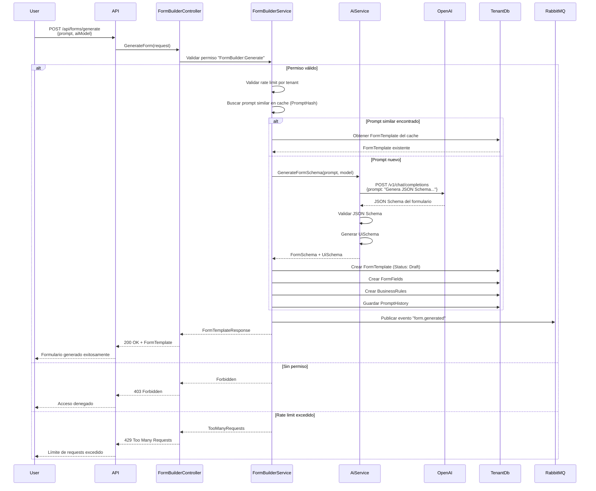

# Documentación de Flujos del Sistema TimeControl

Este documento describe los flujos completos del sistema TimeControl usando diagramas C4 y Mermaid.

---

## Diagrama C4 - Contexto del Sistema

### Nivel 1: Contexto


---

## Diagrama C4 - Contenedores

### Nivel 2: Contenedores


---

## Flujos de Casos de Uso

### 1. Flujo de Autenticación (Login)


### 2. Flujo de Resolución de Tenant


### 3. Flujo de Creación de Módulo con IA


### 4. Flujo de Asignación Masiva de Permisos


### 5. Flujo de Generación de Formulario con IA



### 6. Flujo de Verificación de Permisos en Endpoint


### 7. Flujo de Publicación de Formulario


### 8. Flujo de Herencia de Permisos


---

## Diagrama de Componentes (C4 Nivel 3)

```mermaid
C4Component
    title Diagrama de Componentes - TimeControl API
    
    Container(webApi, "ASP.NET Core Web API", "C# .NET 8")
    
    Component_Boundary(controllers, "Controllers") {
        Component(authCtrl, "AuthController", "Autenticación")
        Component(usersCtrl, "UsersController", "Gestión de usuarios")
        Component(rolesCtrl, "RolesController", "Gestión de roles")
        Component(modulesCtrl, "ModulesController", "Gestión de módulos")
        Component(permissionsCtrl, "PermissionsController", "Gestión de permisos")
        Component(formsCtrl, "FormBuilderController", "Form Builder con IA")
        Component(companiesCtrl, "CompaniesController", "Gestión de empresas")
    }
    
    Component_Boundary(services, "Services") {
        Component(authSvc, "AuthService", "Autenticación")
        Component(userSvc, "UserService", "Usuarios")
        Component(roleSvc, "RoleService", "Roles")
        Component(moduleSvc, "ModuleService", "Módulos")
        Component(permSvc, "PermissionService", "Permisos")
        Component(formSvc, "FormBuilderService", "Form Builder")
        Component(aiSvc, "AiFormService", "Integración IA")
    }
    
    Component_Boundary(middleware, "Middleware") {
        Component(tenantMw, "TenantMiddleware", "Resolución de tenant")
        Component(authMw, "AuthMiddleware", "Autenticación JWT")
        Component(permMw, "PermissionMiddleware", "Autorización")
    }
    
    Component_Boundary(data, "Data Access") {
        Component(tenantResolver, "TenantResolver", "Resolución de tenant")
        Component(dbContext, "TenantDbContext", "EF Core Context")
        Component(masterDb, "MasterDbContext", "EF Core Master")
    }
    
    System_Ext(openai, "OpenAI API")
    SystemDb(tenantDb, "Tenant DB")
    SystemDb(masterDb, "Master DB")
    
    Rel(authCtrl, authSvc, "Usa")
    Rel(usersCtrl, userSvc, "Usa")
    Rel(rolesCtrl, roleSvc, "Usa")
    Rel(modulesCtrl, moduleSvc, "Usa")
    Rel(permissionsCtrl, permSvc, "Usa")
    Rel(formsCtrl, formSvc, "Usa")
    
    Rel(formSvc, aiSvc, "Usa")
    Rel(aiSvc, openai, "Llama API")
    
    Rel(tenantMw, tenantResolver, "Usa")
    Rel(tenantResolver, masterDb, "Consulta")
    
    Rel(authSvc, dbContext, "Usa")
    Rel(userSvc, dbContext, "Usa")
    Rel(roleSvc, dbContext, "Usa")
    Rel(moduleSvc, dbContext, "Usa")
    Rel(permSvc, dbContext, "Usa")
    Rel(formSvc, dbContext, "Usa")
    
    Rel(dbContext, tenantDb, "Lee/Escribe")
```

---

## Flujo de Datos - Arquitectura Multi-Tenant


---

## Resumen de Flujos Implementados

### Flujos Existentes (Implementados)

1. **Autenticación**
   - Login con email/password
   - Refresh token
   - Logout
   - Validación de token

2. **Gestión de Usuarios**
   - Registro de usuarios
   - Listado de usuarios
   - Actualización de usuarios
   - Eliminación (soft delete)
   - Asignación de roles

3. **Gestión de Roles**
   - Crear rol
   - Listar roles
   - Actualizar rol
   - Eliminar rol
   - Asignar permisos a rol

4. **Gestión de Empresas (Master)**
   - Crear empresa
   - Listar empresas
   - Actualizar empresa
   - Actualizar conexión de BD

5. **Usuarios Maestros (Master)**
   - Registrar usuario maestro
   - Asignar empresa a usuario maestro
   - Revocar acceso a empresa

### Flujos Nuevos (A Implementar)

1. **Gestión de Módulos**
   - Crear módulo
   - Generar módulo con IA
   - Listar módulos
   - Actualizar módulo
   - Eliminar módulo

2. **Gestión de Permisos**
   - Asignar permisos masivamente
   - Obtener permisos efectivos de usuario
   - Obtener permisos de módulo
   - Herencia de permisos

3. **Form Builder con IA**
   - Generar formulario desde prompt
   - Listar formularios
   - Actualizar formulario
   - Publicar formulario
   - Versionar formulario
   - Rollback de versión

---

**Última actualización**: 2024-01-15  
**Versión**: 1.0.0

