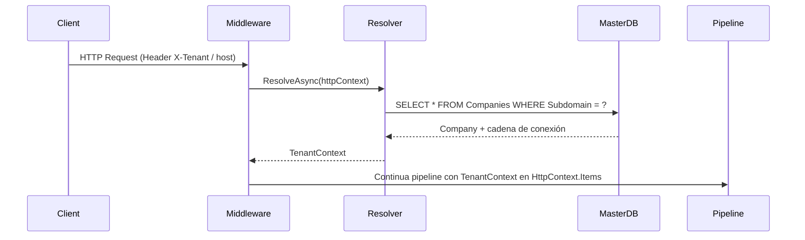
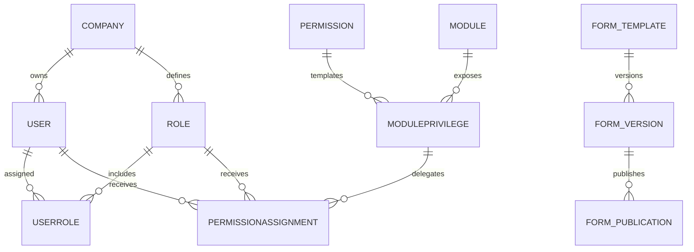
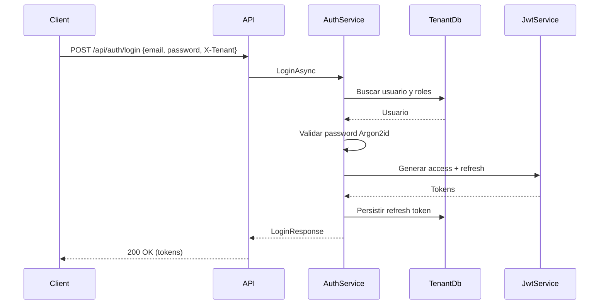
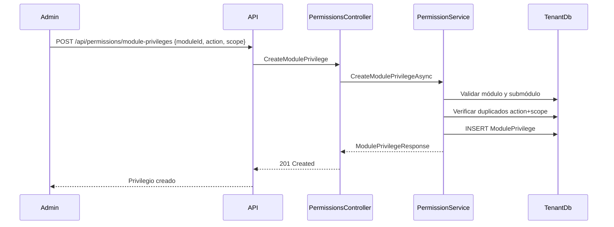
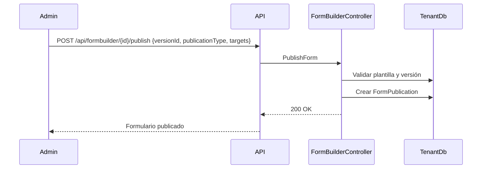

# TimeControl API – Documentación Maestra

> **Última actualización:** 2025-11-13  
> Plataforma SaaS multi-tenant para gestión de tiempos, módulos gobernados y Form Builder asistido por IA.

---

## 1. Resumen Ejecutivo
- Plataforma **multi-tenant**: una base de datos por empresa (tenant) + base maestra para orquestación.
- **Gobernanza modular**: catálogo de permisos base, privilegios por módulo, asignaciones a roles y usuarios.
- **Form Builder IA**: generación, versionado y publicación de formularios con proveedores de IA (pendiente de integración productiva).
- **Principios**: SOLID, DDD, CQRS, OWASP API Top 10, observabilidad desde el diseño.

### Objetivos actuales
1. Consolidar servicios de autenticación, usuarios, roles, módulos, permisos, diagnóstico y master data.
2. Completar el CRUD expandido de permisos (catálogo y privilegios) para habilitar scopes especiales.
3. Preparar documentación única y centralizada para equipos de producto e ingeniería.

---

## 2. Stack Tecnológico

| Capa                | Tecnología / Herramientas                                                                 |
|---------------------|-------------------------------------------------------------------------------------------|
| Backend             | .NET 9, ASP.NET Core Web API                                                              |
| Datos               | MySQL/MariaDB (BD maestra + BD por tenant), EF Core 9                                     |
| Autenticación       | JWT + Refresh Tokens rotativos, soporte para OpenID Connect (roadmap)                     |
| Validación          | FluentValidation                                                                          |
| Messaging / Cache   | RabbitMQ (eventos), Redis (cache distribuido, sesiones)                                   |
| Observabilidad      | Serilog, OpenTelemetry (pendiente), Elastic Stack (roadmap)                               |
| IA                  | Azure OpenAI / OpenAI SDK (pendiente estabilización)                                      |
| DevOps / CI-CD      | GitHub Actions / Azure DevOps (planificado), SonarCloud (roadmap)                         |
| Testing             | xUnit, FluentAssertions, WebApplicationFactory (estructura preparada)                     |

---

## 3. Arquitectura General

### 3.1 Visión de Contenedores

```mermaid
%% Diagrama de alto nivel
flowchart LR
    subgraph Cliente
        UI[Front-End / Aplicación Cliente]
    end

    subgraph API[TimeControl API (.NET 8)]
        MW[Tenant Middleware]
        CTRL[Controllers REST]
        SVC[Servicios de Dominio]
        REP[EF Core TenantDbContext]
    end

    subgraph Datos
        MasterDB[(Master DB<br/>timecontrol_master)]
        TenantDB[(Tenant DB<br/>timecontrol_{empresa})]
        Redis[(Redis Cache)]
    end

    subgraph Integraciones
        OpenAI[(Azure/OpenAI)]
        Rabbit[(RabbitMQ)]
    end

    UI -->|HTTPS + JWT + X-Tenant| MW
    MW -->|Resuelve tenant| MasterDB
    MW --> CTRL
    CTRL --> SVC
    SVC --> REP
    REP --> TenantDB
    SVC --> Redis
    SVC --> Rabbit
    SVC --> OpenAI
```

### 3.2 Flujo de Resolución de Tenant



---

## 4. Multi-Tenancy & Contexto
- **Patrón vigente**: *una base de datos por tenant*.  
  - BD maestra: catálogo de empresas (`Companies`), usuarios maestros, asignaciones multi-empresa.
  - BD tenant: datos operativos de la empresa (users, roles, módulos, formularios, etc.).
- **Resolución de tenant**: header `X-Tenant`, query `tenant`, o subdominio. Middlewares:
  1. `TenantMiddleware` → invoca `ITenantResolver`.
  2. `TenantResolver` → obtiene configuración en `timecontrol_master`.
  3. `TenantDbContextFactory` → crea `TenantDbContext` con connection string específica.
- **Seguridad**: cada request debe incluir `X-Tenant`; controladores usan `TenantDbContextFactory` para aislar datos.

> ⚠️ El documento `ARQUITECTURA_COMPLETA.md` describía un esquema alterno (TenantId en todas las tablas).  
> La implementación actual mantiene la separación por base de datos; este README refleja el estado real.

---

## 5. Modelo de Datos Principal

### 5.1 Tabla Maestra vs Tenant

| Dominio            | Base de datos | Tablas relevantes                                                           |
|--------------------|---------------|------------------------------------------------------------------------------|
| Master             | `timecontrol_master` | Companies, MasterUsers, MasterUserSessions, MasterUserCompanies, AuditLogs |
| Autenticación      | Tenant DB     | Users, RefreshTokens, SecurityLogs                                          |
| Roles & Permisos   | Tenant DB     | Roles, UserRoles, Permissions (catálogo), ModulePrivileges, PermissionAssignments, PermissionGroups |
| Módulos            | Tenant DB     | Modules, SubModules                                                         |
| Form Builder IA    | Tenant DB     | FormTemplate, FormVersion, FormPublication, BusinessRule, AiIntegrationProvider, FormAudit |
| Productividad      | Tenant DB     | Projects, Activities, ProjectUsers, Timesheets, Notifications, Tickets      |

Scripts SQL: `Data/Scripts/01_master_database.sql`, `02_tenant_template.sql`, `13_create_modules_permissions_tables.sql`, `14_seed_modules_permissions_data.sql`, `15_verify_modules_permissions_tables.sql`, entre otros.

### 5.2 Relación de Entidades Clave (Mermaid)



---

## 6. Dominios y Endpoints

### 6.1 Autenticación (`AuthController`)
| Método | Ruta              | Descripción                                   | Tablas      |
|--------|-------------------|-----------------------------------------------|-------------|
| POST   | `/api/auth/login` | Login por email/teléfono + password/MFA       | `Users`, `RefreshTokens` |
| POST   | `/api/auth/refresh` | Rotación de tokens                          | `RefreshTokens` |
| POST   | `/api/auth/logout` | Revoca refresh token                          | `RefreshTokens` |
| GET    | `/api/auth/me`     | Datos del usuario autenticado                 | `Users` |
| GET    | `/api/auth/validate` | Valida JWT actual                           | `Users` |

### 6.2 Usuarios & Roles
- `UsersController`: CRUD usuario, soft delete, asignación de roles.
- `RolesController`: CRUD rol, garantiza unicidad de nombres, protección de roles del sistema.

### 6.3 Permisos & Privilegios (`PermissionsController`)
- **Catálogo base (`Permissions`)**
  - `GET /api/permissions/catalog?code=&name=&includeSystem=&onlyDefaults=` devuelve el listado filtrado.
  - `GET /api/permissions/catalog/{id}` detalle + timestamps de auditoría.
  - `POST /api/permissions/catalog` crea definiciones globales (códigos normalizados a minúsculas).
  - `PUT /api/permissions/catalog/{id}` actualiza nombre, descripción y banderas (`isSystem`, `isDefaultForModule`).
  - `DELETE /api/permissions/catalog/{id}` elimina si no está referenciado por `ModulePrivileges`.

- **Privilegios por módulo (`ModulePrivileges`)**
  - `GET /api/permissions/modules/{moduleId}/privileges?includeDeleted=&subModuleId=&permissionCode=` filtros opcionales.
  - `POST /api/permissions/modules/{moduleId}/privileges` vincula un permiso del catálogo al módulo.
  - `PUT /api/permissions/modules/{moduleId}/privileges/{id}` permite cambiar overrides y estado por defecto.
  - `DELETE /api/permissions/modules/{moduleId}/privileges/{id}` soft delete (valida asignaciones activas).
  - `POST /api/permissions/modules/{moduleId}/privileges/{id}/restore` revierte el soft delete.
  - `POST /api/permissions/modules/{moduleId}/privileges/defaults` regenera los privilegios marcados como default en el catálogo.

- **Asignación**
- `GET /api/permissions/me` / `user/{id}`: resumen efectivo agrupado por módulo, cada módulo devuelve `{ id, code, name, description, privileges[] }`; cada privilegio expone `{ modulePrivilegeId, permissionId, permissionAssignmentId, code, name, hasPermission }`.
  - `GET /api/permissions/roles/{roleId}/modules?moduleId=` matriz de privilegios por módulo.
  - `PUT /api/permissions/roles/{roleId}/modules` payload `{ modules: [{ moduleId, privileges: [{ modulePrivilegeId, isGranted }] }] }`.
  - `POST /api/permissions/check` valida `{ moduleId, permissionCode, userId? }` y detalla la fuente de la concesión.

### 6.8 Swagger con ejemplos interactivos
- Cada endpoint activo expone ejemplo de request/response en Swagger usando `RequestResponseExamplesOperationFilter`.
- Los ejemplos se definen en `Swagger/Examples/SwaggerExamplesCatalog.cs`; revisar `SWAGGER_ENDPOINTS.md` para el inventario completo de rutas.
- Para añadir o actualizar ejemplos:
  1. Registrar el `methodKey` (`{Namespace}.{Controller}.{Action}` en minúsculas) en el catálogo.
  2. Proveer `RequestExample` (body o parámetros) y `Responses` por código HTTP.
- Ejecutar `dotnet build` para validar que la serialización de ejemplos no genere errores antes de publicar cambios.

### 6.4 Módulos (`ModulesController`)
- CRUD completo, validación de `MenuOrder >= 0`, edición restringida para módulos del sistema (solo icono/orden).
- Endpoint `POST /api/modules/generate`: placeholder para generación IA (retorna “En desarrollo”).

### 6.5 Form Builder IA (`FormBuilderController`)
- Generar borrador desde prompt (`POST /generate`), listar, versionar, publicar, rollback.
- Tabla `FormTemplate` y relacionadas (`FormVersion`, `FormPublication`, `BusinessRule`, etc.).

### 6.6 Master (`MasterUsersController`, `CompaniesController`)
- Gestión multi-empresa (registro de usuario maestro, asignación de empresas, CRUD de compañías).
- Scripts iniciales: `03_register_siscore.sql`, `04_verify_siscore.sql`, etc.

### 6.7 Diagnóstico (`DiagnosticsController`)
- `/api/diagnostics/tenant`: verifica resolución de tenant.
- `/api/diagnostics/master-db`: health check master.
- `/api/diagnostics/generate-password-hash`: utilitario desarrollo (no exponer en prod).

> 🔗 Todos los endpoints están incluidos en `TimeControlApi.postman_collection.json`.  
> Ver instrucciones en `README_POSTMAN.md`.

---

## 7. Flujos Clave (Mermaid)

### 7.1 Autenticación
*(extraído y adaptado de documentación previa)*


### 7.2 Administración de Privilegios


### 7.3 Publicación de Formulario


---

## 8. Seguridad y Cumplimiento
- **Autorización**: `[Authorize]` en controllers, validación de permisos via `PermissionService`.
- **JWT**: expiración corta, refresh rotativo, binding a dispositivo/IP.
- **Validaciones OWASP**:
  - Sanitización de entrada (`FluentValidation`, normalización de códigos).
  - Rate limiting planificado por tenant.
  - Auditoría (`SecurityLogs`, `AuditLogs`).
- **Datos sensibles**: contraseñas con Argon2id; se recomienda cifrar campos PII adicionales.

---

## 9. Observabilidad y Operaciones
- **Logging**: Serilog (configurable hacia consola y sinks externos).
- **Monitoring**: health checks disponibles; se recomienda agregar métricas y traces con OpenTelemetry.
- **Alertas**: planificar dashboards (Grafana/Kibana) y alertas de latencia.

---

## 10. DevOps & Scripts
- Scripts SQL en `Data/Scripts`:
  - `01_master_database.sql`: estructura master.
  - `02_tenant_template.sql`: plantilla tenant base.
  - `13_create_modules_permissions_tables.sql`: tablas `ModulePrivileges`, `PermissionAssignments`, etc.
  - `14_seed_modules_permissions_data.sql`: inserta privilegios base y grupos.
  - `15_verify_modules_permissions_tables.sql`: checklist post-deploy.
- **Migraciones EF Core**: pendiente generar tras consolidar cambios (ver TODO `create-migration`).
- **CI/CD**: preparar pipeline con pasos de build, test, análisis estático y despliegue (infra IaC).

---

## 11. Testing
- **Unit Tests**: diseñar para servicios (ej. `PermissionService`, `ModuleService`).
- **Integration Tests**: `WebApplicationFactory` con fixtures multi-tenant.
- **Smoke Tests**: sobre endpoints críticos (auth, usuarios, permisos).
- **Pendientes**: crear suites para Form Builder y master data.

---

## 12. Postman & Referencias
- Colección: `TimeControlApi.postman_collection.json` (importar siguiendo `README_POSTMAN.md`).
- Variables: `baseUrl`, `tenant`, `accessToken`, `refreshToken`.
- Scripts de verificación: `15_verify_modules_permissions_tables.sql`.

---

## 13. Roadmap & Próximos Pasos
1. **Integrar generación IA real** en `ModuleService` y `FormBuilderService`.
2. **Implementar pipelines** CI/CD con despliegue automatizado.
3. **Agregar migraciones oficiales** EF Core para nuevas tablas.
4. **UI de permisos** para visualizar privilegios heredados y overrides.
5. **Observabilidad** completa (tracing, métricas, dashboards).
6. **Documentar endpoints restantes** (Timesheets, Projects) conforme se habiliten.

---

## 14. Documentos Complementarios
- `COMO_USAR_TENANT.md`: guía rápida para llamadas con header `X-Tenant`.
- `CONFIGURACION_CONEXION_BD.md`: parámetros de conexión para tenants.
- `README_POSTMAN.md`: instrucciones detalladas de colección Postman.
- `SOLUCION_ERROR_*`: troubleshooting histórico (mantener como referencia).
- `Data/Scripts/README_MODULES_PERMISSIONS.md`: instrucciones específicas para scripts de permisos.

> 🗑️ Los archivos `ARQUITECTURA.md` y `ARQUITECTURA_COMPLETA.md` fueron retirados por contener información duplicada o desactualizada respecto a la arquitectura vigente. Este README centraliza la documentación oficial del backend TimeControl.

---

## 15. Glosario (extracto)

| Término            | Descripción                                                                             |
|--------------------|-----------------------------------------------------------------------------------------|
| Tenant             | Empresa/instancia lógica que posee su propia base de datos.                             |
| Module             | Componente funcional del sistema (timesheet, reports, settings...).                     |
| Permission         | Acción base asociada a un módulo (`create`, `read`, `approve`, ...).                    |
| ModulePrivilege    | Acción + scope concreto (OwnTenant/SubTenant/System) habilitado para asignación.        |
| PermissionAssignment | Relación directa de privilegios hacia roles o usuarios (incluye vigencias).          |
| Form Template      | Definición base del formulario generado o creado manualmente.                           |
| Master User        | Usuario con acceso multi-empresa gestionado desde la BD maestra.                        |

---

### Contacto
- Equipo Backend TimeControl  
- Documentación actualizada en este repositorio.  
- Cualquier cambio relevante debe reflejarse aquí y en la colección Postman.


